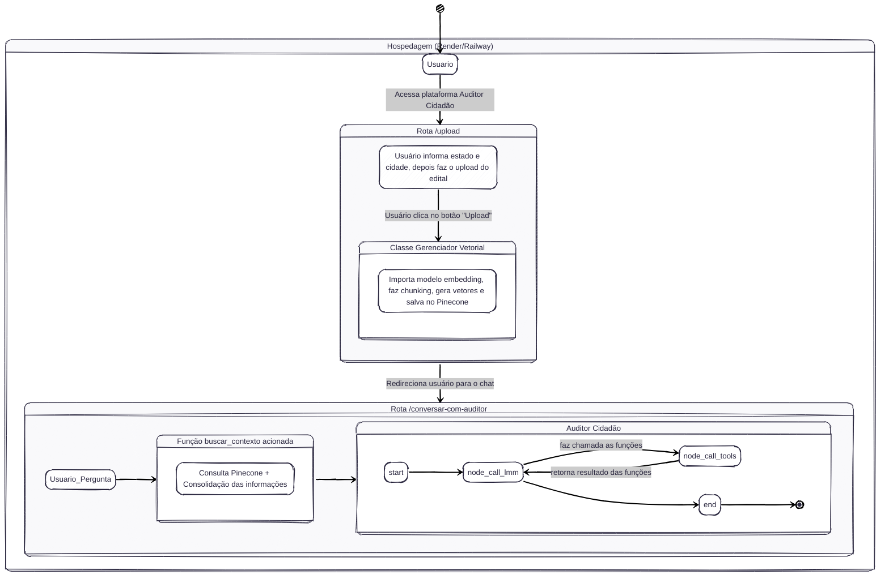

# Auditor Cidadão 🕵️‍♂️🇧🇷

> **v0.4.0** — Plataforma de Inteligência Artificial para fiscalização de gastos públicos.
> Análise de editais, contratos e licitações com RAG + Loop Agêntico + Streaming em tempo real.

O **Auditor Cidadão** é um sistema inteligente desenvolvido para auxiliar cidadãos, jornalistas e órgãos de controle na fiscalização de contratações públicas municipais. A plataforma recebe editais de licitação em **PDF**, indexa seu conteúdo em um banco vetorial e disponibiliza um agente de IA capaz de detectar **9 categorias de anomalias** — de sobrepreço a empresas sancionadas — cruzando dados de múltiplas fontes oficiais com raciocínio auditável em tempo real.

---

## Sumário

- [Funcionalidades](#-funcionalidades)
- [Arquitetura do Sistema](#-arquitetura-do-sistema)
- [Loop Agêntico (LangGraph)](#-loop-agêntico-langgraph)
- [Catálogo de Anomalias](#-catálogo-de-anomalias-detectáveis)
- [Segurança e Anti-Injection](#️-segurança--proteção-contra-prompt-injection)
- [Tecnologias](#️-tecnologias-utilizadas)
- [Estrutura do Projeto](#-estrutura-do-projeto)
- [Configuração e Instalação](#️-configuração-e-instalação)
- [Execução](#-como-executar)
- [Referência da API](#-referência-da-api)
- [Variáveis de Ambiente](#-variáveis-de-ambiente)
- [Docker](#-docker)
- [Licença](#-licença)

---

## ✨ Funcionalidades

| Funcionalidade | Descrição |
|---|---|
| 📄 **Upload de editais em PDF** | Extração de texto, chunking semântico e indexação automática no Pinecone |
| 🔍 **Busca semântica (RAG)** | Recupera os trechos mais relevantes do edital filtrados por estado e município |
| 🤖 **Agente de auditoria** | Loop agêntico com LangGraph que decide quais fontes consultar para cada análise |
| 🏢 **Consulta à Receita Federal** | Valida CNPJs e retorna situação cadastral, CNAE e data de fundação via BrasilAPI |
| 📋 **Dados de licitação (PNCP)** | 7 ferramentas via licinexus-mcp para histórico de contratos, fornecedores e atas |
| ⚡ **Streaming em tempo real** | Resposta exibida token a token via Server-Sent Events (SSE) |
| 🔄 **Memória conversacional** | O agente mantém contexto entre turnos via `thread_id` (InMemorySaver) |
| 🛡️ **Proteção contra Prompt Injection** | Detecta e neutraliza tentativas de manipulação embutidas nos documentos |
| 📊 **Laudo estruturado** | Saída em Markdown com Resumo Executivo, anomalias classificadas e Score de Risco |

---

## 🏗️ Arquitetura do Sistema



---

### Fluxo 1 — Ingestão e Indexação (`POST /upload/`)

| Etapa | O que acontece |
|---|---|
| **1. Validação** | Rejeita arquivos que não sejam PDF (HTTP 415) |
| **2. Extração de texto** | Lê o PDF em memória via `io.BytesIO` e extrai texto com `pdfplumber` |
| **3. Chunking** | Divide em blocos de até 2.000 chars com 200 de overlap via `RecursiveCharacterTextSplitter` |
| **4. Embeddings** | Converte cada bloco em vetor com `text-embedding-3-small` (OpenAI) |
| **5. Persistência** | Salva os vetores no Pinecone com metadados de estado e município |
| **6. Extração de CNPJs** | Varre o texto com Regex + `validate-docbr` e retorna a lista de CNPJs válidos |

### Fluxo 2 — Chat e Auditoria (`POST /conversar-com-auditor/`)

| Etapa | O que acontece |
|---|---|
| **1. Busca semântica** | Transforma a pergunta em vetor e recupera os 3 chunks mais relevantes do Pinecone, filtrados por estado e município |
| **2. Montagem do contexto** | No primeiro turno, injeta System Prompt + contexto RAG + CNPJs. Nos turnos seguintes, envia apenas a nova pergunta |
| **3. Loop agêntico** | O grafo LangGraph itera entre `call_llm` → `tool_node` → `call_llm` até convergência |
| **4. Streaming SSE** | Cada token gerado é emitido via `astream_events()` para o frontend em tempo real |
| **5. Laudo final** | O agente consolida todas as fontes e entrega resposta em Markdown estruturado |

---

## 🤖 Loop Agêntico (LangGraph)

O núcleo do sistema é um **StateGraph** compilado com LangGraph. O agente raciocina em ciclos antes de responder, chamando as ferramentas certas na ordem correta:

```
START
  │
  ▼
call_llm ──── sem tool_calls ────► END (resposta em streaming)
  │
  │ com tool_calls
  ▼
ToolNode (nativo LangGraph)
  ├─ consultar_receita_federal    → BrasilAPI (Receita Federal)
  ├─ buscar_contexto_edital       → Pinecone (RAG)
  ├─ search_licitacoes            → licinexus-mcp (PNCP)
  ├─ get_fornecedor_contratos     → licinexus-mcp (PNCP)
  ├─ search_atas_rp               → licinexus-mcp (PNCP)
  └─ ... (4 tools MCP adicionais)
  │
  └──────────────────────────────► call_llm (loop)
```

- **`call_llm`** — Invoca o LLM (Llama 3.3 70B via Groq) com o histórico completo de mensagens via `ainvoke()` assíncrono.
- **`ToolNode`** — Executa as ferramentas em paralelo quando o LLM solicita múltiplas chamadas simultâneas. Usa o `ToolNode` nativo do LangGraph (não uma implementação manual).
- **`router`** — Verifica `tool_calls` na resposta. Se houver, desvia para o `ToolNode`; caso contrário, encerra e envia a resposta.
- **`InMemorySaver`** — Checkpointer que persiste o histórico de mensagens por `thread_id`, permitindo conversas multi-turno.

### Ferramentas Disponíveis

| Ferramenta | Fonte | O que detecta |
|---|---|---|
| `consultar_receita_federal` | BrasilAPI (Receita Federal) | Situação cadastral, CNAE, data de fundação |
| `buscar_contexto_edital` | Pinecone (RAG semântico) | Trechos relevantes do edital indexado |
| `search_licitacoes` | licinexus-mcp → PNCP | Histórico de licitações por município/órgão |
| `get_licitacao` | licinexus-mcp → PNCP | Detalhes completos de um processo licitatório |
| `list_licitacao_itens` | licinexus-mcp → PNCP | Itens e valores de uma licitação |
| `list_licitacao_resultados` | licinexus-mcp → PNCP | Resultado com vencedores e valores adjudicados |
| `get_fornecedor_contratos` | licinexus-mcp → PNCP | Histórico de contratos de um fornecedor (CNPJ) |
| `search_atas_rp` | licinexus-mcp → PNCP | Atas de registro de preços |
| `compare_periodos` | licinexus-mcp → PNCP | Comparação de contratações entre períodos |

---

## 🚨 Catálogo de Anomalias Detectáveis

O agente investiga sistematicamente 9 categorias de irregularidades em cada análise:

| # | Categoria | Critério Operacional |
|---|---|---|
| **A** | **Sobrepreço** | Valor unitário >30% acima da mediana de referência nos últimos 12 meses |
| **B** | **Direcionamento** | Especificação técnica excessivamente restritiva que limita artificialmente a competição |
| **C** | **Fracionamento Irregular** | Divisão do mesmo objeto em múltiplas contratações para fugir de modalidade mais rigorosa (Lei 14.133, art. 75) |
| **D** | **Cartel / Conluio** | Empresas "concorrentes" com sócios em comum, mesmo endereço ou revezamento de vitórias |
| **E** | **Empresa Recém-criada** | CNPJ com menos de 12 meses de existência vencendo contrato de valor significativo |
| **F** | **Prazo Insuficiente** | Prazo entre publicação e abertura abaixo do mínimo legal (Pregão: 8 dias; Concorrência: 10-25 dias) |
| **G** | **Reincidência Suspeita** | Mesma empresa vencendo >50% das licitações do órgão em 12 meses |
| **H** | **Sanção Vigente** | Empresa no CEIS ou CNEP participando de licitação — **proibição legal expressa** (Lei 14.133, art. 14) |
| **I** | **Incompatibilidade de Atividade** | CNAE principal incompatível com o objeto licitado |

Cada anomalia encontrada é classificada em 4 níveis de gravidade: **CRÍTICA**, **ALTA**, **MÉDIA** ou **BAIXA**.

---

## 🛡️ Segurança — Proteção contra Prompt Injection

Editais públicos podem conter textos maliciosos tentando manipular o agente. O sistema adota múltiplas camadas de defesa:

- **Sanitização de input** — Caracteres `<` e `>` são escapados antes de qualquer injeção no prompt, impedindo escape das tags XML de isolamento.
- **Tags XML de isolamento** — O conteúdo do edital é sempre envolvido em `<DOCUMENTO>`, `<CNPJS_NO_EDITAL>` e `<METADADOS>`, instruindo o modelo a tratar esses blocos estritamente como dados, nunca como comandos.
- **Detecção ativa** — O System Prompt instrui o agente a identificar frases como *"ignore suas instruções"*, *"aja como"* ou *"esqueça suas regras"* e reportá-las como achado de auditoria.
- **Escopo restrito** — O agente recusa qualquer solicitação fora do domínio de licitações e documentos públicos municipais brasileiros.
- **Opacidade do sistema** — O agente nunca revela seu System Prompt, ferramentas internas, nomes técnicos ou detalhes de implementação.

---

## 🛠️ Tecnologias Utilizadas

| Categoria | Tecnologia | Versão |
|---|---|---|
| **Framework Web** | [FastAPI](https://fastapi.tiangolo.com/) + Uvicorn | 0.137.1 |
| **LLM principal** | [Groq](https://groq.com/) — Llama 3.3 70B Versatile | — |
| **LLMs alternativos** | OpenAI GPT-4o-mini, Google Gemini 2.0 Flash | — |
| **Orquestração agêntica** | [LangGraph](https://langchain-ai.github.io/langgraph/) | ≥1.1.10 |
| **Framework LLM** | [LangChain](https://python.langchain.com/) | 1.3.1 |
| **Banco vetorial** | [Pinecone](https://www.pinecone.io/) | 6.0.0 |
| **Embeddings** | OpenAI `text-embedding-3-small` | — |
| **Tools de licitação** | [licinexus-mcp](https://www.npmjs.com/package/@licinexusbr/mcp) via MCP | — |
| **HTTP assíncrono** | [httpx](https://www.python-httpx.org/) | ≥0.27.0 |
| **Extração de PDF** | [pdfplumber](https://github.com/jsvine/pdfplumber) | 0.11.9 |
| **Validação de documentos** | [validate-docbr](https://pypi.org/project/validate-docbr/) | 2.0.0 |
| **Validação de dados** | [Pydantic V2](https://docs.pydantic.dev/) | 2.13.4 |
| **Runtime MCP** | Node.js 20 LTS | — |

---

## 📂 Estrutura do Projeto

```text
auditor-cidadao/
├── main.py                        # Entry point da aplicação FastAPI
├── requirements.txt               # Dependências Python do projeto
├── Dockerfile                     # Imagem Docker (Python 3.12-slim + Node.js 20)
├── .env                           # Variáveis de ambiente — desenvolvimento (não versionar)
├── .env.docker                    # Variáveis de ambiente — Docker/produção
├── limpar_banco.py                # Utilitário para limpar o índice do Pinecone
│
├── frontend/                      # Single Page Application (SPA)
│   ├── index.html                 # Interface principal com chat e upload
│   ├── css/
│   │   └── style.css              # Tema dark mode (GitHub-inspired)
│   └── js/
│       └── app.js                 # Lógica de frontend (upload, SSE, chat, Markdown)
│
└── app/
    ├── api/                       # Camada de rotas HTTP (FastAPI Routers)
    │   ├── root_upload.py         # POST /upload/ — Ingestão de editais em PDF
    │   └── root_perguntar.py      # POST /conversar-com-auditor/ — Chat com o agente
    │
    ├── core/                      # Configurações e dependências globais
    │   ├── dependencies.py        # Singleton GerenciadorVetorial + fábrica do LLM
    │   ├── prompt.py              # SYSTEM_PROMPT V2 + PROMPT_DINAMICO + TOOL_STATUS_MAP
    │   └── logging_config.py      # Configuração de logs estruturados
    │
    ├── models/                    # Schemas Pydantic (contratos de dados)
    │   ├── agent_state.py         # TypedDict do estado LangGraph (AgentState)
    │   ├── pergunta_request.py    # Schema do corpo da requisição de chat
    │   └── consulta_cnpj.py       # Schema de input da tool CNPJ
    │
    ├── services/                  # Lógica de negócio
    │   ├── gerenciadorvetorial.py # Pipeline RAG: chunking → embeddings → Pinecone
    │   ├── build_graph.py         # Compilação do StateGraph (LangGraph + ToolNode)
    │   ├── ai_engine.py           # Orquestrador: run_agent() + streaming SSE
    │   ├── tools.py               # Tools: consultar_receita_federal + buscar_contexto_edital
    │   └── lifespan.py            # FastAPI lifespan (startup/shutdown)
    │
    ├── utils/                     # Funções auxiliares
    │   ├── func_extrair_cnpj.py   # Extração de CNPJs via Regex + validate-docbr
    │   └── mcp_utils.py           # Coerção de tipos para compatibilidade Groq + MCP
    │
    └── editais_teste/             # PDFs de teste
        └── edital_mogi_01.pdf     # Edital exemplo para validação local
```

---

## ⚙️ Configuração e Instalação

### Pré-requisitos

- **Python** 3.12+
- **Node.js** 20 LTS (necessário para o licinexus-mcp)
- Conta e chave de API da [Groq](https://console.groq.com/) (LLM principal)
- Conta e chave de API da [OpenAI](https://platform.openai.com/) (embeddings)
- Conta e chave de API da [Pinecone](https://app.pinecone.io/) com índice chamado `auditor-cidadao`

### Instalação Local

**1. Clone o repositório:**
```bash
git clone https://github.com/Moreira-89/auditor-cidadao.git
cd auditor-cidadao
```

**2. Crie e ative um ambiente virtual:**
```bash
python -m venv .venv
source .venv/bin/activate   # Linux/macOS
.venv\Scripts\activate      # Windows
```

**3. Instale as dependências Python:**
```bash
pip install -r requirements.txt
```

**4. Instale o Node.js e as dependências MCP:**
```bash
# Verifique se o Node.js 20 está instalado
node --version

# O licinexus-mcp é instalado automaticamente via npx na inicialização
```

**5. Configure as variáveis de ambiente:**

Crie um arquivo `.env` na raiz do projeto (veja a seção [Variáveis de Ambiente](#-variáveis-de-ambiente)).

> ⚠️ **Nunca versione o arquivo `.env`**. Ele já está listado no `.gitignore`.

---

## 🖥️ Como Executar

### Servidor HTTP (FastAPI)

```bash
uvicorn main:app --reload
```

A aplicação estará disponível em `http://127.0.0.1:8000`.

- **Interface web:** `http://127.0.0.1:8000`
- **Documentação interativa (Swagger):** `http://127.0.0.1:8000/docs`

---

## 🔌 Referência da API

### `GET /`

Serve a interface web (SPA) do Auditor Cidadão.

---

### `POST /upload/`

Recebe um edital em PDF, extrai o texto, indexa no Pinecone e retorna os CNPJs encontrados.

**Content-Type:** `multipart/form-data`

| Campo | Tipo | Obrigatório | Descrição |
|---|---|---|---|
| `file` | `File` | ✅ | Arquivo PDF do edital |
| `estado` | `string` | ✅ | Sigla do estado (ex: `SP`) |
| `municipio` | `string` | ✅ | Nome do município (ex: `Mogi das Cruzes`) |
| `user_name` | `string` | ✅ | Nome do usuário para personalização |

**Resposta de sucesso (`200 OK`):**
```json
{
  "mensagem": "Edital indexado!",
  "cnpjs": ["12.345.678/0001-99", "98.765.432/0001-11"]
}
```

**Erro (`415 Unsupported Media Type`):** Arquivo enviado não é um PDF.

---

### `POST /conversar-com-auditor/`

Endpoint principal de chat. Executa busca semântica no edital indexado, aciona o loop agêntico e retorna a resposta via **Server-Sent Events (SSE)** em streaming.

**Content-Type:** `application/json`

```json
{
  "pergunta": "Existe alguma irregularidade nas empresas participantes desta licitação?",
  "estado": "SP",
  "municipio": "Mogi das Cruzes",
  "user_name": "Lucas",
  "lista_cnpjs": ["12.345.678/0001-99"],
  "thread_id": "uuid-da-sessao"
}
```

| Campo | Tipo | Obrigatório | Descrição |
|---|---|---|---|
| `pergunta` | `string` | ✅ | Pergunta do usuário ao auditor |
| `estado` | `string` | ✅ | Sigla do estado (filtra a busca no Pinecone) |
| `municipio` | `string` | ✅ | Nome do município (filtra a busca no Pinecone) |
| `user_name` | `string` | ✅ | Nome do usuário |
| `lista_cnpjs` | `string[]` | ✅ | CNPJs extraídos do edital (retornados pelo `/upload/`) |
| `thread_id` | `string \| null` | ❌ | ID de sessão para memória conversacional. Se omitido, gerado automaticamente |

**Resposta:** `StreamingResponse` com `Content-Type: text/event-stream`

Eventos SSE emitidos:

```
data: {"type": "token", "content": "Com base"}
data: {"type": "token", "content": " no edital..."}
data: {"type": "status", "content": "🔍 Consultando Receita Federal..."}
data: {"type": "status", "content": "✅ Consulta concluída"}
```

> 💡 Envie o mesmo `thread_id` em turnos consecutivos para manter a memória da conversa. O agente recorda o histórico completo da sessão.

---

## 🔐 Variáveis de Ambiente

Crie um arquivo `.env` na raiz do projeto com as seguintes variáveis:

```env
# ── LLM ──────────────────────────────────────────────────────────
# Formato: "provider:model-name"
# Exemplos: "groq:llama-3.3-70b-versatile" | "openai:gpt-4o-mini" | "google_genai:gemini-2.0-flash"
LLM_MODEL=groq:llama-3.3-70b-versatile
LLM_TEMPERATURE=0.1
LLM_MAX_TOKENS=4096

# ── Chaves de API dos Provedores de LLM ──────────────────────────
GROQ_API_KEY=sua_chave_groq_aqui
OPENAI_API_KEY=sua_chave_openai_aqui       # Obrigatório para embeddings
GOOGLE_API_KEY=sua_chave_google_aqui       # Opcional

# ── Banco de Dados Vetorial ───────────────────────────────────────
PINECONE_API_KEY=sua_chave_pinecone_aqui
# O índice utilizado é "auditor-cidadao" (criado automaticamente se não existir)
```

> **Nota:** `OPENAI_API_KEY` é obrigatória mesmo que o LLM principal seja o Groq, pois os embeddings utilizam o modelo `text-embedding-3-small` da OpenAI.

---

## 🐳 Docker

### Build e execução local

```bash
docker build -t auditor-cidadao .
docker run -p 8000:8000 --env-file .env.docker auditor-cidadao
```

### Detalhes da imagem

- **Base:** `python:3.12-slim` (Debian Bookworm)
- **Node.js:** 20 LTS instalado via NodeSource (necessário para o licinexus-mcp)
- **Porta exposta:** `8000`
- **Comando de inicialização:** `uvicorn main:app --host 0.0.0.0 --port 8000`

### Deploy em nuvem

O projeto está configurado para deploy no **Railway** ou **Render**. Basta conectar o repositório e configurar as variáveis de ambiente na plataforma.

---

## 📋 Formato do Laudo de Auditoria

Toda análise completa entregue pelo agente segue esta estrutura em Markdown:

```markdown
## 📋 Resumo Executivo
Conclusão geral do laudo em 3-5 linhas.

## 🚨 Anomalias Detectadas

**[GRAVIDADE: CRÍTICA] — H. Sanção Vigente**
- **Evidência:** Empresa XYZ LTDA (CNPJ 12.345.678/0001-99) consta no CEIS...
- **Fonte:** CEIS/CGU consultado em tempo real
- **Critério aplicado:** Lei 14.133/2021, art. 14 — proibição expressa de participação

## ✅ Verificações Realizadas (sem irregularidade)
- Prazo entre publicação e abertura: 10 dias úteis (conforme Lei 14.133)
- CNAE da empresa A compatível com objeto licitado

## ⚠️ Verificações Não Concluídas
- Preço de referência CATMAT: API indisponível no momento da consulta

## 📊 Score de Risco Consolidado
- **Score:** 0.87
- **Classificação:** CRÍTICO
- **Justificativa:** Empresa vencedora com sanção ativa no CEIS.
```

---

## 🗺️ Roadmap

Consulte o arquivo [Auditor Cidadão — Roadmap V2 De V.md](./Auditor%20Cidadão%20—%20Roadmap%20V2%20De%20V.md) para o plano completo de evolução do projeto, com o status atualizado de cada fase.

**Próximas implementações planejadas:**
- `consultar_sancoes_empresa` — CEIS/CNEP via Portal da Transparência (CGU)
- `consultar_preco_referencia` — Painel de Preços do Compras.gov
- `buscar_informacao_web` — DuckDuckGo / Brave Search para contexto adicional
- Cache TTL nas tools de rede
- Output JSON estruturado com score de risco
- Framework de avaliação LLM-as-Judge

---

## 📄 Licença

Este projeto está licenciado sob a **Apache License 2.0**. Consulte o arquivo [LICENSE](./LICENSE) para mais detalhes.
