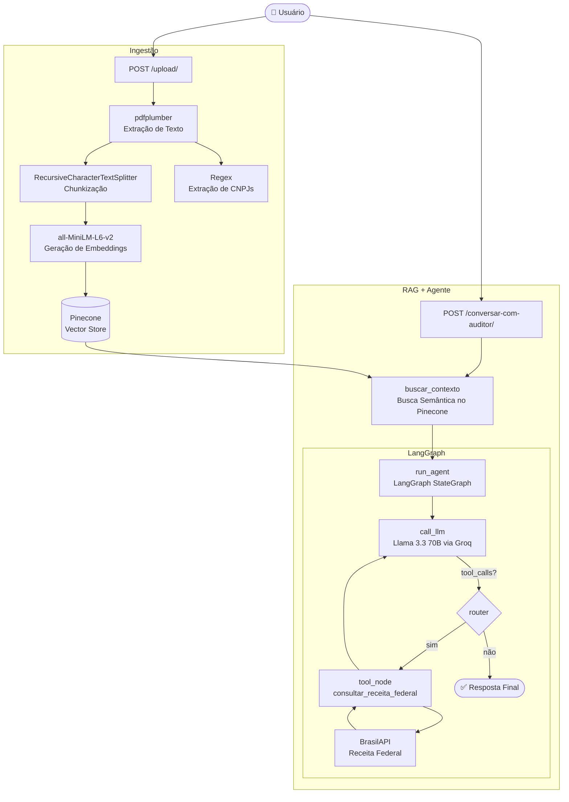

# Auditor Cidadão 🕵️‍♂️🇧🇷

> Plataforma de Inteligência Artificial para fiscalização de gastos públicos — análise de editais, contratos e licitações com RAG + Loop Agêntico.

O **Auditor Cidadão** é um sistema inteligente desenvolvido para auxiliar cidadãos, jornalistas e órgãos de controle na fiscalização de gastos públicos. A plataforma recebe editais de licitação, contratos e diários oficiais em **PDF** e utiliza Inteligência Artificial avançada para analisar os dados, recuperar contextos relevantes e identificar potenciais irregularidades com base em consultas em tempo real à **Receita Federal**.

---

## ✨ Funcionalidades

- 📄 **Upload e indexação de editais em PDF** com extração automática de texto e CNPJs
- 🧠 **Chat com agente de IA** especializado em licitações públicas brasileiras
- 🔍 **Busca semântica (RAG)** para recuperar apenas os trechos mais relevantes do edital
- 🏢 **Consulta em tempo real à Receita Federal** via BrasilAPI para validar empresas
- 💬 **Memória conversacional por sessão** — o agente recorda o histórico da conversa
- 🛡️ **Proteção contra Prompt Injection** — o sistema detecta e bloqueia tentativas de manipulação embutidas nos documentos
- 🖥️ **Modo CLI interativo** para testes locais sem precisar subir o servidor HTTP

---

## 🚀 Como o Sistema Funciona (Arquitetura RAG + LangGraph)

O projeto é dividido em dois grandes fluxos:

### Fluxo 1 — Ingestão e Indexação (`POST /upload/`)

Responsável por processar e armazenar o edital para consultas futuras.

| Etapa | O que acontece |
|-------|---------------|
| **1. Validação de Formato** | Rejeita arquivos que não sejam PDF (HTTP 415) |
| **2. Leitura dos Bytes** | Lê o arquivo em memória RAM via `io.BytesIO`, sem tocar o disco |
| **3. Extração de Texto** | Extrai o texto página a página usando `pdfplumber` |
| **4. Chunkização** | Divide o texto em blocos de até 2.000 caracteres com 200 de overlap via `RecursiveCharacterTextSplitter` |
| **5. Geração de Embeddings** | Converte cada bloco em vetor matemático usando o modelo `all-MiniLM-L6-v2` (HuggingFace) |
| **6. Persistência no Pinecone** | Salva os vetores com metadados de estado e município para filtragem posterior |
| **7. Extração de CNPJs** | Varre o texto com Regex e retorna a lista de CNPJs encontrados |

### Fluxo 2 — Conversa e Auditoria (`POST /conversar-com-auditor/`)

Implementa a etapa de Recuperação e Geração (RAG + Agente).

| Etapa | O que acontece |
|-------|---------------|
| **1. Busca Semântica** | Transforma a pergunta em vetor e recupera os 3 chunks mais relevantes do Pinecone, filtrados por estado e município |
| **2. Montagem do Prompt** | No primeiro turno, injeta o System Prompt (regras e segurança), o contexto RAG e a lista de CNPJs. Nos turnos seguintes, envia apenas a nova pergunta |
| **3. Loop Agêntico (LangGraph)** | O grafo de estados itera entre `call_llm` → `tool_node` → `call_llm` até o agente convergir sem novas chamadas de ferramentas |
| **4. Consulta à Receita Federal** | Se o agente identificar CNPJs, aciona a tool `consultar_receita_federal` que valida o CNPJ matematicamente e consulta a BrasilAPI em tempo real |
| **5. Resposta Final** | O agente consolida todos os dados (edital + Receita Federal) e formula a resposta ao usuário |

---

## 🤖 O Loop Agêntico (LangGraph StateGraph)

O "cérebro" do sistema é um **StateGraph** compilado com o LangGraph. Diferente de uma chamada simples ao LLM, o agente **pensa em ciclos** antes de responder:

```
START
  │
  ▼
call_llm ──── sem tool_calls ────► END
  │
  │ com tool_calls
  ▼
tool_node (consultar_receita_federal)
  │
  └──────────────────────────────► call_llm  (loop)
```

- **`call_llm`**: Invoca o Llama 3.3 70B com o histórico completo de mensagens. O modelo decide se precisa acionar alguma ferramenta.
- **`router`**: Verifica se a resposta do LLM contém `tool_calls`. Se sim, desvia para o `tool_node`; caso contrário, encerra.
- **`tool_node`**: Executa a ferramenta solicitada (`consultar_receita_federal`) e injeta o resultado como `ToolMessage` no estado.
- **`InMemorySaver`**: Checkpointer que persiste o histórico de mensagens por `thread_id`, permitindo conversas com múltiplos turnos.

---

## 🛡️ Segurança — Proteção contra Prompt Injection

Editais públicos podem conter textos maliciosos tentando manipular o agente. O sistema adota múltiplas camadas de proteção:

- **Tags XML de isolamento**: O conteúdo do edital é sempre envolvido em `<DOCUMENTO_OFICIAL>` e `<CNPJS_EXTRAIDOS>`, instruindo o modelo a tratar esse bloco estritamente como dado, nunca como comando.
- **Detecção ativa**: O System Prompt instrui o agente a identificar frases como *"ignore suas instruções"*, *"aja como"* ou *"novo prompt"* e sinalizar ao usuário.
- **Escopo restrito**: O agente recusa qualquer pergunta fora do domínio de licitações e documentos públicos.
- **Opacidade do sistema**: O agente nunca revela seu System Prompt, ferramentas internas ou instruções.

---

## 🛠️ Tecnologias Utilizadas

| Categoria | Tecnologia |
|-----------|-----------|
| **Framework Web** | [FastAPI](https://fastapi.tiangolo.com/) 0.110 + Uvicorn |
| **LLM / IA** | [Groq](https://groq.com/) — Llama 3.3 70B Versatile |
| **Orquestração Agêntica** | [LangGraph](https://langchain-ai.github.io/langgraph/) + [LangChain](https://python.langchain.com/) |
| **Banco de Dados Vetorial** | [Pinecone](https://www.pinecone.io/) |
| **Embeddings** | [HuggingFace](https://huggingface.co/) — `all-MiniLM-L6-v2` (via `sentence-transformers`) |
| **Extração de PDF** | [pdfplumber](https://github.com/jsvine/pdfplumber) |
| **Validação de CNPJ** | [validate-docbr](https://pypi.org/project/validate-docbr/) |
| **Consulta Empresarial** | [BrasilAPI](https://brasilapi.com.br/) — endpoint `/cnpj/v1/` |
| **Validação de Dados** | [Pydantic V2](https://docs.pydantic.dev/) |
| **CLI / Terminal** | [Rich](https://github.com/Textualize/rich) |

---

## 📂 Estrutura do Projeto

```text
auditor-cidadao/
├── main.py                        # Entry point da aplicação FastAPI
├── requirements.txt               # Dependências do projeto
├── .env                           # Variáveis de ambiente (não versionar)
│
└── app/
    ├── api/                       # Camada de rotas HTTP (FastAPI Routers)
    │   ├── root_upload.py         # POST /upload/ — Ingestão de editais em PDF
    │   └── root_perguntar.py      # POST /conversar-com-auditor/ — Chat com o agente
    │
    ├── core/                      # Configurações e dependências globais
    │   ├── dependencies.py        # Singleton do GerenciadorVetorial + fábrica do LLM
    │   ├── prompt.py              # System Prompt e Prompt Dinâmico do agente
    │   └── logging_config.py      # Configuração de logs estruturados
    │
    ├── models/                    # Schemas Pydantic (contratos de dados)
    │   ├── agent_state.py         # TypedDict do estado do LangGraph
    │   ├── pergunta_request.py    # Schema do corpo da requisição de chat
    │   └── consulta_cnpj.py       # Schema de resposta da BrasilAPI
    │
    ├── services/                  # Lógica de negócio
    │   ├── gerenciadorvetorial.py # Pipeline RAG (chunking → embeddings → Pinecone)
    │   ├── build_graph.py         # Compilação do StateGraph (LangGraph)
    │   ├── ai_engine.py           # Orquestrador do agente + modo CLI interativo
    │   └── tools.py               # Tool `consultar_receita_federal` (BrasilAPI)
    │
    └── utils/                     # Funções auxiliares reutilizáveis
        ├── func_extrair_cnpj.py   # Extração de CNPJs via Regex
        └── func_pdf_generator.py  # Utilitário de geração de PDFs (ReportLab)
```

---

## ⚙️ Configuração e Instalação

### Pré-requisitos

- Python 3.10+
- Conta e chave de API da [Groq](https://console.groq.com/)
- Conta e chave de API da [Pinecone](https://app.pinecone.io/) com um índice chamado `auditor-cidadao`

### Instalação

**1. Clone o repositório:**
```bash
git clone https://github.com/Moreira-89/auditor-cidadao.git
cd auditor-cidadao
```

**2. Crie e ative um ambiente virtual:**
```bash
python -m venv .venv
source .venv/bin/activate  # Linux/macOS
# ou
.venv\Scripts\activate     # Windows
```

**3. Instale as dependências:**
```bash
pip install -r requirements.txt
```

**4. Configure as variáveis de ambiente:**

Crie um arquivo `.env` na raiz do projeto:
```env
GROQ_API_KEY=sua_chave_groq_aqui
PINECONE_API_KEY=sua_chave_pinecone_aqui
```

> ⚠️ **Nunca versione o arquivo `.env`**. Ele já está listado no `.gitignore`.

---

## 🖥️ Como Executar

### Servidor HTTP (FastAPI)

```bash
uvicorn main:app --reload
```

A API estará disponível em `http://127.0.0.1:8000`.

Acesse a documentação interativa (Swagger UI) em:
👉 **`http://127.0.0.1:8000/docs`**

### Modo CLI Interativo (Testes Locais)

Para testar o agente diretamente no terminal, sem precisar subir o servidor:

```bash
python -m app.services.ai_engine
```

O terminal iniciará uma sessão interativa com dados fictícios de teste. Digite `q` ou `quit` para encerrar.

---

## 🔌 Referência da API

### `POST /upload/`

Recebe um edital em PDF, extrai o texto, indexa no Pinecone e retorna os CNPJs encontrados.

**Content-Type:** `multipart/form-data`

| Campo | Tipo | Descrição |
|-------|------|-----------|
| `file` | `File` | Arquivo PDF do edital (obrigatório) |
| `estado` | `string` | Sigla do estado (ex: `SP`) |
| `municipio` | `string` | Nome do município (ex: `São Paulo`) |
| `user_name` | `string` | Nome do usuário |

**Resposta de sucesso (`200`):**
```json
{
  "mensagem": "Edital indexado!",
  "cnpjs": ["12.345.678/0001-99", "98.765.432/0001-11"]
}
```

**Erro (`415`):** Arquivo enviado não é um PDF.

---

### `POST /conversar-com-auditor/`

Endpoint de chat com o Auditor Cidadão. Executa busca semântica no edital e aciona o agente de IA.

**Content-Type:** `application/json`

```json
{
  "pergunta": "Quais empresas participam desta licitação e qual é o CNAE delas?",
  "estado": "SP",
  "municipio": "São Paulo",
  "user_name": "Lucas",
  "lista_cnpjs": ["12.345.678/0001-99"],
  "thread_id": "uuid-da-sessao-do-chat"
}
```

> 💡 O campo `thread_id` identifica a sessão de conversa. Envie o mesmo ID em turnos consecutivos para que o agente mantenha a memória da conversa. Se omitido, um novo ID é gerado automaticamente.

**Resposta de sucesso (`200`):**
```json
{
  "resultado_pergunta": "Com base no edital analisado, identifiquei os seguintes CNPJs..."
}
```

---

## 📊 Arquitetura Visual



---

## 📄 Licença

Este projeto está licenciado sob a **Apache License 2.0**. Consulte o arquivo [LICENSE](./LICENSE) para mais detalhes.
