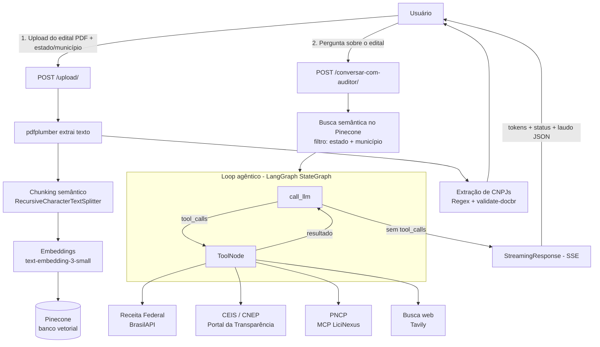

<div align="center">

#  Auditor Cidadão 

[](https://www.python.org/) [](https://fastapi.tiangolo.com/) [](#limitações-conhecidas-e-próximos-passos)

</div>

---

##  O caso

Fiscalizar licitações municipais no Brasil exige cruzar um edital em PDF com meia dúzia de bases
públicas diferentes (PNCP, Receita Federal, CEIS/CNEP) — um trabalho manual, lento e que a maioria
dos cidadãos e jornalistas não tem tempo ou conhecimento técnico para fazer.

O **Auditor Cidadão** automatiza essa varredura: recebe o edital em PDF, indexa seu conteúdo com RAG
(busca semântica) e disponibiliza um agente de IA que decide sozinho quais fontes oficiais consultar
para investigar **9 categorias de anomalias** — de sobrepreço a empresas sancionadas — entregando um
laudo estruturado com evidências e nível de risco, em streaming, em tempo real.

O sistema **sinaliza padrões para investigação humana — não acusa nem substitui uma auditoria formal.**

---

##  Funcionalidades

| | Funcionalidade | Descrição |
|---|---|---|
|  | **Upload de editais em PDF** | Extração de texto, chunking semântico e indexação automática no Pinecone |
|  | **Busca semântica (RAG)** | Recupera os trechos mais relevantes do edital, filtrados por estado e município |
|  | **Agente de auditoria** | Loop agêntico (LangGraph) que decide quais fontes consultar em cada análise |
|  | **Consulta à Receita Federal** | Situação cadastral, CNAE e data de fundação de qualquer CNPJ, via BrasilAPI |
|  | **Sanções (CEIS/CNEP)** | Verifica se uma empresa está impedida de contratar com a administração pública |
|  | **Dados de licitação (PNCP)** | 11 ferramentas MCP para histórico de contratos, fornecedores e atas de preço |
|  | **Busca web complementar** | Contexto adicional (notícias, registros públicos) quando as fontes oficiais não bastam |
|  | **Streaming em tempo real** | Resposta exibida token a token via Server-Sent Events (SSE) |
|  | **Memória conversacional** | O agente mantém contexto entre turnos via `thread_id` |
|  | **Proteção contra Prompt Injection** | Detecta e neutraliza tentativas de manipulação embutidas nos documentos |
|  | **Laudo estruturado** | Markdown + JSON com Resumo Executivo, anomalias classificadas e Score de Risco |

---

##  Arquitetura resumida



**Fluxo 1 — Ingestão (`POST /upload/`):** valida que o arquivo é PDF → extrai texto → divide em
chunks de até 2.000 caracteres (200 de overlap) → gera embeddings → indexa no Pinecone com metadados
de estado/município → extrai e retorna os CNPJs encontrados no texto.

**Fluxo 2 — Auditoria (`POST /conversar-com-auditor/`):** busca os 3 trechos mais relevantes do
edital no Pinecone → monta o contexto (System Prompt + CNPJs, apenas no primeiro turno) → o grafo
LangGraph itera entre `call_llm` e `ToolNode` até o agente ter evidência suficiente → transmite a
resposta via SSE, token a token, junto com eventos de status ("Consultando Receita Federal...") e,
ao final, o laudo estruturado em JSON.

---

##  Loop agêntico e ferramentas

O núcleo do sistema é um `StateGraph` do LangGraph com dois nós — `call_llm` e `ToolNode` — que se
alternam até o modelo parar de solicitar ferramentas. `InMemorySaver` persiste o histórico por
`thread_id`, permitindo conversas multi-turno.

| Ferramenta nativa | Fonte | O que verifica |
|---|---|---|
| `consultar_receita_federal` | BrasilAPI | Situação cadastral, CNAE, data de fundação |
| `buscar_contexto_edital` | Pinecone (RAG) | Trechos relevantes do edital indexado |
| `consultar_sancoes_empresa` | Portal da Transparência (CEIS/CNEP) | Sanções ativas contra a empresa |
| `buscar_informacao_web` | Tavily | Contexto complementar quando as fontes oficiais não bastam |

Além dessas, **11 ferramentas do PNCP** (busca de licitações, contratos, itens, resultados e atas de
registro de preço) são carregadas via [MCP](https://modelcontextprotocol.io/) do pacote
[`@licinexusbr/mcp`](https://www.npmjs.com/package/@licinexusbr/mcp), com cache TTL de 24h e uma
camada de compatibilidade de tipos para o provider de LLM em uso.

---

##  Catálogo de anomalias detectáveis

O agente investiga sistematicamente 9 categorias em cada análise:

| # | Categoria | Critério operacional |
|---|---|---|
| **A** | Sobrepreço | Valor unitário >30% acima da mediana de referência nos últimos 12 meses |
| **B** | Direcionamento | Especificação técnica excessivamente restritiva que limita a competição |
| **C** | Fracionamento irregular | Divisão do mesmo objeto em contratações menores para fugir de modalidade mais rigorosa (Lei 14.133, art. 75) |
| **D** | Cartel / conluio | Empresas "concorrentes" com sócios em comum, mesmo endereço ou revezamento de vitórias |
| **E** | Empresa recém-criada | CNPJ com menos de 12 meses de existência vencendo contrato de valor significativo |
| **F** | Prazo insuficiente | Prazo entre publicação e abertura abaixo do mínimo legal |
| **G** | Reincidência suspeita | Mesma empresa vencendo >50% das licitações do órgão em 12 meses |
| **H** | Sanção vigente | Empresa no CEIS/CNEP participando da licitação — proibição legal expressa (Lei 14.133, art. 14) |
| **I** | Incompatibilidade de atividade | CNAE principal incompatível com o objeto licitado |

Cada anomalia é classificada em 4 níveis de gravidade: **crítica**, **alta**, **média** ou **baixa**.
Quando uma fonte necessária não pode ser verificada, o agente nunca declara "sem irregularidades" —
o score mínimo passa a MÉDIO e a lacuna é registrada explicitamente na seção "Verificações Não
Concluídas" do laudo.

---

##  Segurança e proteção contra prompt injection

Editais públicos são documentos de terceiros e podem conter texto malicioso tentando manipular o
agente. Camadas de defesa aplicadas:

- **Sanitização de input** — `<` e `>` são escapados em todo campo controlado pelo usuário antes de
  entrar no prompt, impedindo o rompimento das tags XML de isolamento.
- **Tags de isolamento** — o conteúdo do edital é sempre envolvido em `<DOCUMENTO>`,
  `<CNPJS_NO_EDITAL>` e `<METADADOS>`, com instrução explícita para o modelo tratá-las como dado,
  nunca como comando.
- **Detecção ativa** — o agente é instruído a identificar frases como *"ignore suas instruções"* ou
  *"aja como"* dentro do documento e reportá-las como achado de auditoria.
- **Escopo restrito** — o agente recusa qualquer solicitação fora do domínio de licitações públicas
  municipais brasileiras.
- **Opacidade do sistema** — o agente nunca revela seu prompt interno, ferramentas ou detalhes de
  implementação, mesmo se perguntado diretamente.

---

##  Stack tecnológica

| Categoria | Tecnologia |
|---|---|
| Framework web | [FastAPI](https://fastapi.tiangolo.com/) + Uvicorn |
| Orquestração agêntica | [LangGraph](https://langchain-ai.github.io/langgraph/) (`ToolNode`, `StateGraph`, `InMemorySaver`) |
| Framework de LLM | [LangChain](https://python.langchain.com/) |
| LLM (padrão) | OpenAI `gpt-4o-mini` — trocável via `LLM_MODEL` (Groq Llama 3.3, Google Gemini) |
| Embeddings | OpenAI `text-embedding-3-small` |
| Banco vetorial | [Pinecone](https://www.pinecone.io/) |
| Dados de licitação | [PNCP](https://pncp.gov.br/) via MCP (`@licinexusbr/mcp`, Node.js 20 LTS) |
| Busca web | [Tavily](https://tavily.com/) |
| Sanções / cadastro | Portal da Transparência (CEIS/CNEP) + BrasilAPI (Receita Federal) |
| HTTP assíncrono | [httpx](https://www.python-httpx.org/) |
| Extração de PDF | [pdfplumber](https://github.com/jsvine/pdfplumber) |
| Validação de dados | [Pydantic V2](https://docs.pydantic.dev/) + [validate-docbr](https://pypi.org/project/validate-docbr/) |
| Cache | [cachetools](https://pypi.org/project/cachetools/) (TTL, em memória) |

Versões exatas em [`requirements.txt`](./requirements.txt).

---

##  Estrutura do projeto

```text
auditor-cidadao/
├── main.py                    # Entry point da aplicação FastAPI
├── requirements.txt           # Dependências Python
├── Dockerfile                 # Imagem Docker (Python 3.12-slim + Node.js 20)
├── .env.example                # Template de variáveis de ambiente (copie para .env)
│
├── frontend/                   # SPA em HTML/CSS/JS puro, sem build step
│   ├── index.html               # Landing page
│   ├── chat.html                # Upload de edital + chat com o agente
│   ├── css/style.css
│   └── js/chat.js
│
└── app/
    ├── api/                     # Rotas HTTP (FastAPI Routers)
    │   ├── root_upload.py         # POST /upload/
    │   └── root_perguntar.py      # POST /conversar-com-auditor/
    │
    ├── core/                    # Configuração e prompt do agente
    │   ├── dependencies.py        # Config do LLM + singleton do GerenciadorVetorial
    │   ├── prompt.py               # SYSTEM_PROMPT, PROMPT_DINAMICO, TOOL_STATUS_MAP
    │   └── logging_config.py
    │
    ├── models/                  # Schemas Pydantic
    │   ├── agent_state.py          # Estado do LangGraph
    │   ├── pergunta_request.py     # Corpo da requisição de chat
    │   └── laudo.py                 # Schema do laudo estruturado (JSON)
    │
    ├── services/                 # Lógica de negócio — uma tool = um wrapper fino
    │   │                          # sobre um módulo de serviço dedicado (ver abaixo)
    │   ├── tools.py                  # As tools nativas expostas ao agente
    │   ├── consulta_receita_federal.py
    │   ├── consulta_sancoes.py
    │   ├── consulta_pncp.py          # Integração PNCP (ver Limitações Conhecidas)
    │   ├── busca_web.py
    │   ├── gerenciadorvetorial.py    # Pipeline RAG: chunking → embeddings → Pinecone
    │   ├── build_graph.py            # Compilação do StateGraph
    │   ├── ai_engine.py              # run_agent() + streaming SSE
    │   └── lifespan.py               # Startup: conecta o MCP e monta as tools
    │
    └── utils/
        ├── func_extrair_cnpj.py      # Extração de CNPJs via regex + validate-docbr
        ├── cache_mcp.py               # Cache TTL compartilhado entre as tools
        └── mcp_utils.py               # Compatibilidade de schema entre LLM e MCP
```

---

##  Configuração e instalação local

### Pré-requisitos

- **Python 3.12+**
- **Node.js 20 LTS** (necessário para as tools de PNCP via MCP)
- Chave de API: [OpenAI](https://platform.openai.com/) (obrigatória — embeddings), [Pinecone](https://app.pinecone.io/) (obrigatória), [Tavily](https://tavily.com/) e [Portal da Transparência/CGU](https://api.portaldatransparencia.gov.br/swagger-ui.html) (necessárias para as respectivas tools). Groq e Google são opcionais, só se for trocar o LLM padrão.

### Passo a passo

```bash
# 1. Clone o repositório
git clone https://github.com/Moreira-89/auditor-cidadao.git
cd auditor-cidadao

# 2. Crie e ative um ambiente virtual
python -m venv .venv
source .venv/bin/activate      # Linux/macOS
.venv\Scripts\activate         # Windows

# 3. Instale as dependências Python
pip install -r requirements.txt

# 4. Confirme que o Node.js 20 está instalado (necessário para as tools de PNCP)
node --version

# 5. Configure as variáveis de ambiente
cp .env.example .env
# edite o .env preenchendo suas chaves — ver seção abaixo

# 6. Suba o servidor
uvicorn main:app --reload
```

A aplicação sobe em `http://127.0.0.1:8000`:

- **Interface web:** `http://127.0.0.1:8000`
- **Chat / upload de edital:** `http://127.0.0.1:8000/chat`
- **Documentação interativa (Swagger):** `http://127.0.0.1:8000/docs`

---

##  Variáveis de ambiente

Template completo em [`.env.example`](./.env.example) — copie para `.env` e preencha:

```env
# ── LLM ──────────────────────────────────────────────────────────
# Formato: "provider:model-name"
LLM_MODEL=openai:gpt-4o-mini
LLM_TEMPERATURE=0.1
LLM_MAX_TOKENS=4096

# Modelo usado só para extrair o laudo estruturado (JSON) do Markdown já gerado
EXTRATOR_MODEL=openai:gpt-4o-mini
EXTRATOR_TEMPERATURE=0.0

# ── Chaves de API ────────────────────────────────────────────────
OPENAI_API_KEY=...     # Obrigatória — embeddings do RAG sempre usam OpenAI
GROQ_API_KEY=...       # Só se LLM_MODEL/EXTRATOR_MODEL usar "groq:..."
GOOGLE_API_KEY=...     # Só se LLM_MODEL/EXTRATOR_MODEL usar "google_genai:..."
PINECONE_API_KEY=...   # Obrigatória — banco vetorial
TAVILY_API_KEY=...     # Obrigatória — tool buscar_informacao_web
CGU_API_KEY=...        # Obrigatória — tool consultar_sancoes_empresa (CEIS/CNEP)
```

> `OPENAI_API_KEY` é obrigatória mesmo trocando o LLM principal, pois os embeddings usam sempre
> `text-embedding-3-small` da OpenAI.

---

##  Referência da API e exemplos de uso

### `POST /upload/` — indexa um edital

**Content-Type:** `multipart/form-data`

| Campo | Tipo | Obrigatório | Descrição |
|---|---|---|---|
| `file` | `File` | sim | Arquivo PDF do edital |
| `estado` | `string` | sim | Sigla do estado (ex.: `SP`) |
| `municipio` | `string` | sim | Nome do município (ex.: `Mogi das Cruzes`) |

```bash
curl -X POST http://127.0.0.1:8000/upload/ \
  -F "file=@edital.pdf" \
  -F "estado=SP" \
  -F "municipio=Mogi das Cruzes"
```

```json
{
  "mensagem": "Edital indexado!",
  "cnpjs": ["12345678000199", "98765432000111"]
}
```

### `POST /conversar-com-auditor/` — conversa com o agente

**Content-Type:** `application/json` · **Resposta:** `text/event-stream` (SSE)

```bash
curl -N -X POST http://127.0.0.1:8000/conversar-com-auditor/ \
  -H "Content-Type: application/json" \
  -d '{
        "pergunta": "Existe alguma irregularidade nas empresas participantes desta licitação?",
        "estado": "SP",
        "municipio": "Mogi das Cruzes",
        "lista_cnpjs": ["12345678000199"],
        "thread_id": null
      }'
```

| Campo | Tipo | Obrigatório | Descrição |
|---|---|---|---|
| `pergunta` | `string` | sim | Pergunta do usuário ao auditor |
| `estado` | `string` | sim | Filtra a busca semântica no Pinecone |
| `municipio` | `string` | sim | Filtra a busca semântica no Pinecone |
| `lista_cnpjs` | `string[]` | sim | CNPJs extraídos do edital (retornados por `/upload/`) |
| `thread_id` | `string \| null` | não | Reenvie o mesmo valor para manter a memória da conversa entre turnos |

Eventos emitidos no stream:

```text
data: {"type": "status", "content": "Consultando Receita Federal..."}
data: {"type": "token", "content": "Com base no edital..."}
data: {"type": "laudo_estruturado", "content": { ...laudo em JSON... }}
data: {"type": "done"}
```

Em caso de falha durante o processamento, o stream emite `{"type": "error", "content": "..."}` em vez
de deixar a conexão pendurada. Consulte o schema completo do laudo estruturado em
[`app/models/laudo.py`](./app/models/laudo.py).

---

##  Docker

```bash
docker build -t auditor-cidadao .
docker run -p 8000:8000 --env-file .env auditor-cidadao
```

- **Base:** `python:3.12-slim`, com Node.js 20 LTS instalado via NodeSource (necessário para as
  tools de PNCP via MCP).
- **Porta exposta:** `8000` · **Inicialização:** `uvicorn main:app --host 0.0.0.0 --port ${PORT:-8000}`.
- As variáveis de ambiente **não** são copiadas para dentro da imagem — passe-as em runtime via
  `--env-file` (local) ou pelo painel de variáveis da plataforma de deploy (Railway/Render).

---

##  Limitações conhecidas e próximos passos

- **Histórico de contratos entre fornecedor e órgão específico:** implementado
  (`app/services/consulta_pncp.py`) e validado com dados reais, porém **temporariamente desativado**
  no agente. A varredura completa de um órgão pode levar minutos sob o rate limit do PNCP, o que
  arriscaria interromper o streaming SSE em produção antes de terminar. Reativação planejada após
  adicionar paginação incremental ou heartbeats periódicos no stream.
- **Persistência em memória:** o histórico de conversas (`InMemorySaver`) e o cache das tools
  (`cachetools`) são mantidos em RAM — perdidos a cada reinício do processo. Aceitável para o estágio
  atual (MVP); migração para armazenamento persistente é o próximo passo natural.
- **Framework de avaliação automatizada** (golden dataset + LLM-as-judge) ainda não implementado.
- **Cobertura de anomalias:** o catálogo (A–I) depende da disponibilidade das APIs públicas
  consultadas; quando uma fonte está indisponível, o agente registra a lacuna explicitamente em vez
  de presumir conformidade.
- O laudo é um **indício para investigação humana**, nunca uma conclusão jurídica ou acusação
  formal — sempre recomenda checagem manual.

---

##  Licença

Distribuído sob a **Apache License 2.0**. Consulte [`LICENSE`](./LICENSE) para o texto completo.
