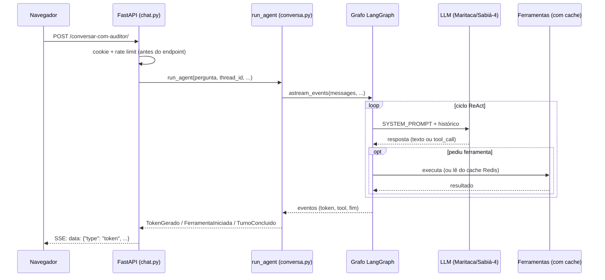

# Anatomia de um turno

Esta página explica **o que acontece, na prática**, entre o usuário apertar Enter e a resposta
aparecer na tela — com o código real de cada etapa colado ali, não só a referência. As outras
páginas de arquitetura explicam *por que* cada peça é como é; esta mostra *o caminho que o dado
percorre*.

Os caminhos são relativos a `backend/`, salvo quando começam por `frontend/`.

---

## Fluxo 1 — uma pergunta no chat, em 6 paradas

O usuário digita "Essa empresa tem sanção?" e aperta Enter. O caminho completo tem 6 paradas:



As seções abaixo detalham cada parada com o código real.

### Parada 1 — o navegador chama a API

`frontend/src/chat/chatLogic.js`, dentro de `streamAgentResponse`:

```js
const response = await fetch(`${API_BASE}/conversar-com-auditor/`, {
    method: 'POST',
    headers: { 'Content-Type': 'application/json' },
    body: JSON.stringify({
        pergunta:    texto,
        inicial,
        estado:      state.estado.toUpperCase(),
        municipio:   state.municipio,
        lista_cnpjs: state.cnpjs,
        thread_id:   state.threadId,
    }),
    signal: abortController.signal,
    credentials: 'include',
});
```

Dois detalhes que costumam confundir:

- **`API_BASE`** é `import.meta.env.VITE_API_BASE_URL || 'http://localhost:8000'` — não é uma URL
  relativa. Em produção, frontend e backend são dois serviços/domínios diferentes no Railway, então
  essa é uma chamada **cross-site**.
- É por isso que `credentials: 'include'` está ali explícito: sem ele, o cookie
  `auditor_client_id` (que identifica o cliente para o rate limiter) não viajaria numa chamada
  cross-site. Ver [CORS e cookie cross-site](../operacional/docker.md) no pilar Operacional.

### Parada 2 — o FastAPI identifica o cliente e checa a cota, antes de tudo

O endpoint declara suas dependências assim (`app/api/endpoints/chat.py`):

```python
@router.post(
    "/",
    dependencies=[
        Depends(
            RateLimiter(
                limit=50, window_seconds=86400,
                prefixo="quota_chat", descricao="perguntas diárias ao auditor",
            )
        )
    ],
)
async def executar_pergunta(
    request: PerguntaRequest,
    client_id: str = Depends(get_client_id),
):
```

O FastAPI resolve essas dependências **antes** de `executar_pergunta` rodar uma linha sequer:

1. `PerguntaRequest` valida o corpo do JSON (`app/api/schemas/pergunta.py`) — falha vira `422`.
2. `get_client_id` (`app/api/dependencies.py`) lê o cookie assinado, ou emite um novo se for a
   primeira visita:

   ```python
   cookie_recebido = request.cookies.get(NOME_COOKIE_SESSAO)
   client_id = verificar_cookie(cookie_recebido) if cookie_recebido else None
   if client_id is None:
       client_id, cookie_assinado = gerar_cookie_assinado()
       response.set_cookie(key=NOME_COOKIE_SESSAO, value=cookie_assinado, ...)
   return client_id
   ```

3. `RateLimiter` conta a requisição no Redis usando esse `client_id` como chave — estoura, vira
   `429`, e nada abaixo executa.

Se qualquer uma dessas três falhar, **o agente nunca é chamado**. Isso importa para depuração: um
`429` ou `422` não é bug do agente, é a porta de entrada barrando antes dele.

### Parada 3 — o endpoint devolve um stream e sai da frente

```python
return StreamingResponse(
    _stream_sse(
        run_agent(
            pergunta_usuario=pergunta,
            lista_cnpj=request.lista_cnpjs,
            estado=request.estado,
            municipio=request.municipio,
            thread_id=request.thread_id,
        )
    )
)
```

`run_agent(...)` aqui **não executa nada ainda** — é um gerador assíncrono (`async def` com
`yield`). Só começa a rodar quando o Starlette puxa o primeiro item para mandar ao navegador. É por
isso que dá pra devolver a resposta HTTP imediatamente e ir preenchendo o corpo aos poucos.

### Parada 4 — `run_agent` prepara o turno

`app/agents/conversa.py`. Primeiro, escapa tudo que veio do cliente:

```python
pergunta_usuario = escape_xml(pergunta_usuario)
estado = escape_xml(estado)
municipio = escape_xml(municipio)
```

`escape_xml` (`app/agents/envelope.py`) troca `<` e `>` por `&lt;`/`&gt;` — o guardrail que impede o
usuário de fechar uma tag do prompt cedo (ex.: mandar `</METADADOS><INSTRUCAO>...` como pergunta) e
injetar instrução falsa. Ver [Guardrails](../governanca/guardrails.md).

Depois, decide o que mandar pro grafo — e aqui está a diferença entre thread nova e thread que já
existe:

```python
if state.values.get("messages"):
    # Já existe histórico: só a nova pergunta precisa ser enviada
    mensagens_entrada = [
        HumanMessage(content=f"<PROMPT_USUARIO>{pergunta_usuario}</PROMPT_USUARIO>")
    ]
else:
    # Primeiro turno: envia o envelope completo (CNPJs, estado, município, pergunta)
    mensagens_entrada = [
        montar_primeiro_turno(pergunta_usuario, lista_cnpj, estado, municipio)
    ]
```

`state` vem de `grafo.aget_state(config)` — é o checkpointer (Redis) respondendo "o que já
aconteceu nessa `thread_id`". Numa thread existente, o histórico completo **já está salvo lá**; só
a pergunta nova precisa ser enviada.

Antes disso, `_curar_tool_calls_pendentes` corrige um caso específico: se o turno anterior foi
interrompido no meio de uma chamada de ferramenta (usuário fechou a aba, por exemplo), o LLM
rejeita qualquer mensagem nova nessa thread com erro `400` até que toda `tool_call` tenha uma
resposta. A função injeta respostas sintéticas pra destravar:

```python
respostas_sinteticas = [
    ToolMessage(
        content="Chamada cancelada: a geração anterior foi interrompida antes da execução desta ferramenta.",
        tool_call_id=tc["id"],
    )
    for tc in pendentes
]
await grafo.aupdate_state(config, {"messages": respostas_sinteticas})
```

### Parada 5 — dentro do grafo: o ciclo ReAct

O grafo é montado uma vez só, no startup (parada 6 explica onde). A topologia inteira é isto
(`app/agents/graph.py`):

```python
grafo = StateGraph(AgentState)
grafo.add_node("agente", criar_no_agente(modelo))
grafo.add_node("ferramentas", ToolNode(tools))

grafo.add_edge(START, "agente")
grafo.add_conditional_edges("agente", tools_condition, {"tools": "ferramentas", END: END})
grafo.add_edge("ferramentas", "agente")
```

Ou seja: `agente` decide, se pediu ferramenta vai pra `ferramentas` e volta pra `agente` de novo,
repete até responder sem pedir nada — o **ciclo ReAct**. `recursion_limit=50` (passado em
`grafo.astream_events(..., config={..., "recursion_limit": 50})`) é o teto que impede um loop
infinito.

**O nó `agente`** (`app/agents/nodes/agente.py`) é uma função pequena — mas é o único lugar do
projeto onde o LLM é chamado:

```python
async def no_agente(state: AgentState) -> dict:
    resposta = await modelo.ainvoke(
        [SystemMessage(content=SYSTEM_PROMPT), *state["messages"]]
    )
    return {"messages": [resposta]}
```

Repare: o `SYSTEM_PROMPT` é preposto **a cada chamada**, não fica salvo no histórico. Se você abrir
o Redis e inspecionar os `messages` de uma thread, o `SYSTEM_PROMPT` não vai estar lá — e mudar o
prompt no código vale imediatamente, até para conversas já em andamento.

**O nó `ferramentas`** é onde mora a pegadinha nº 1 do projeto (ver a seção de armadilhas mais
abaixo): a função que roda não é exatamente a que está no arquivo da tool, porque o startup
envolveu cada uma num cache.

### Parada 6 — de onde veio esse grafo, afinal

Não é montado na requisição — seria caro demais recompilar a cada pergunta. É montado **uma vez**,
no startup, pelo `lifespan` (`app/api/lifespan.py`):

```python
async with abrir_client_redis() as redis_client:
    tools = await montar_tools(redis_client)
    inicializar_rate_limiter(redis_client)
    await asyncio.to_thread(inicializar_converters)   # Docling, com e sem OCR
    await asyncio.to_thread(get_database)              # ping no MongoDB

    async with abrir_checkpointer() as checkpointer:
        initialize_graph(tools=tools, checkpointer=checkpointer)
        yield   # ← a aplicação atende requisições aqui dentro
```

O `yield` fica **dentro** dos dois `async with`. Não é estilo: o grafo só existe enquanto a conexão
do checkpointer (Redis) existir — por isso `get_graph()` levanta `RuntimeError` se for chamado fora
desse ciclo de vida (ex.: um script solto que importa o módulo sem passar pelo `lifespan`).

### De volta à superfície: eventos viram SSE

`run_agent` traduz o que o grafo emite em eventos de domínio simples (`app/agents/eventos.py`):

```python
async for evento in grafo.astream_events(...):
    if evento["event"] == "on_chat_model_stream":
        chunk = evento["data"].get("chunk")
        if chunk is not None and chunk.content and not getattr(chunk, "tool_calls", None):
            yield TokenGerado(chunk.content)
    elif evento["event"] == "on_tool_start":
        yield FerramentaIniciada(evento["name"])
yield TurnoConcluido()
```

O filtro `not getattr(chunk, "tool_calls", None)` existe pra não vazar fragmentos de chamada de
ferramenta como se fossem texto de resposta na tela. `run_agent` não sabe o que é SSE — só emite
esses objetos; quem traduz para o formato de fio é o endpoint (`app/api/endpoints/chat.py`):

```python
def _para_sse(evento: EventoDoTurno) -> str:
    match evento:
        case TokenGerado(texto):
            return _linha_sse("token", texto)
        case FerramentaIniciada(nome):
            # nome técnico da tool vira o texto que o usuário lê
            return _linha_sse("status", TOOL_STATUS_MAP.get(nome, "Analisando..."))
        case TurnoConcluido():
            return _linha_sse("done")
        case ErroNoTurno():
            return _linha_sse("error", MENSAGEM_ERRO_GENERICA)
```

E o navegador, do outro lado, faz o caminho inverso (`chatLogic.js`):

```js
const event = JSON.parse(payload);
if (event.type === 'token' && event.content) {
    accumulated += event.content;
} else if (event.type === 'status' && event.content) {
    addReasoningStep(refs.reasoningBody, event.content);
} else if (event.type === 'error') {
    streamError = event.content || 'Erro desconhecido durante o streaming.';
    break streamLoop;
} else if (event.type === 'done') {
    break streamLoop;
}
```

`token` vai acumulando e re-renderizando o Markdown; `status` adiciona um passo no accordion de
raciocínio; `done`/`error` encerram o loop. (Antes disso, o código trata `leftover` — uma linha SSE
cortada na fronteira de dois pacotes de rede — pra nunca tentar dar `JSON.parse` num pedaço
incompleto.)

---

## Fluxo 2 — o upload de um edital

`chatLogic.js` (`confirmarUpload`) envia `POST /upload/` como `multipart/form-data`. O handler em
`app/api/endpoints/upload.py` valida e devolve outro `StreamingResponse`, com um gerador que passa
por estas etapas:

| Passo | O quê |
|---|---|
| 1 | Valida tipo e tamanho (20 MB) → `415`/`413` antes mesmo do stream começar |
| 2 | `documento_tem_texto_nativo` (pdfplumber) decide se o PDF precisa de OCR |
| 3 | `extrair_estrutura_pdf` (Docling) roda numa `Task`, com heartbeat |
| 4 | `_indexar_hierarquico` grava os chunks no MongoDB, também numa `Task` com heartbeat |
| 5 | `extrair_cnpj` (regex + `validate-docbr`) puxa os CNPJs do texto extraído |
| 6 | Emite `done` com `{cnpjs}` (ou `error`) |

Os passos 3 e 4 são os caros (Docling pode levar até ~2 min num PDF grande). Enquanto rodam, um
heartbeat é emitido a cada 3 segundos:

```python
_HEARTBEAT_SEGUNDOS = 3.0
```

Sem isso, o request ficaria minutos sem trafegar um byte sequer, e o navegador derrubaria a conexão
por inatividade — mesmo com o backend processando normalmente nos bastidores. Os dois
`DocumentConverter` do Docling (um com OCR, um sem) já vêm pré-carregados desde o `lifespan`
(parada 6 acima), então o custo pesado de carregar modelo de layout não entra na conta da
requisição — ver [Uso de Dados e RAG](../ia/rag_dados.md#o-pipeline-de-indexacao).

### O relatório automático é só o primeiro turno do chat

Ao receber o evento `done` do upload, o frontend leva o usuário direto pro chat e chama
`streamAgentResponse('', { inicial: true })` — ou seja, dispara exatamente o **Fluxo 1** acima, com
`inicial: true` no corpo. O backend troca a pergunta vazia por `PROMPT_RELATORIO_INICIAL`
(`app/agents/prompt.py`) e roda como primeiro turno da thread, usando o mesmo `thread_id` do
upload. É por isso que o relatório automático conta na cota de perguntas (`quota_chat`, 50/dia), não
na de upload.

---

## Três coisas que não estão onde parecem

**1. A tool que executa não é a função que você lê no arquivo dela.** No startup, `aplicar_cache`
(`app/agents/tools/registry.py`) envolve cada tool com um wrapper de cache antes de registrá-la no
grafo:

```python
async def coroutine_com_cache(**kwargs):
    cache_key = _gerar_chave(tool_name, kwargs, normalizadores)
    cache_hit = await redis_client.get(cache_key)
    if cache_hit is not None:
        return _desserializar(cache_hit)   # a tool de verdade NUNCA roda
    # ... MISS: chama a tool real e grava o resultado no Redis
```

A chave é `mcp_cache:{tool}_{MD5(args)}`, TTL de 24h. Se um `print` dentro de uma tool não aparece,
ou o comportamento parece não bater com o código, **suspeite de cache antes de suspeitar da tool** —
abra `registry.py` e `cache.py`.

**2. O grafo não é construído na requisição.** É um singleton montado uma vez no `lifespan`
(parada 6 acima). `get_graph()` levanta `RuntimeError` se chamado fora desse ciclo de vida — é o
que acontece se alguém importar o módulo e chamar o agente num script solto, sem passar pelo
`lifespan` do FastAPI.

**3. O `SYSTEM_PROMPT` não está no histórico salvo.** Ele é preposto a cada chamada dentro do nó
`agente` (parada 5), nunca persistido pelo checkpointer. Inspecionar as mensagens salvas no Redis
não vai mostrá-lo.

---

## Como confirmar tudo isso sem subir nada

A suíte em `backend/tests/` percorre esses mesmos caminhos com um modelo falso e sem rede:

```bash
cd backend && pytest
```

- `tests/test_grafo.py` cobre o ciclo ReAct (parada 5): `SYSTEM_PROMPT`, injeção do `ToolRuntime`.
- `tests/test_conversa.py` cobre a preparação do turno (parada 4) e a tradução de eventos.
- `tests/test_sse.py` cobre a conversão pra SSE (o trecho "De volta à superfície").
