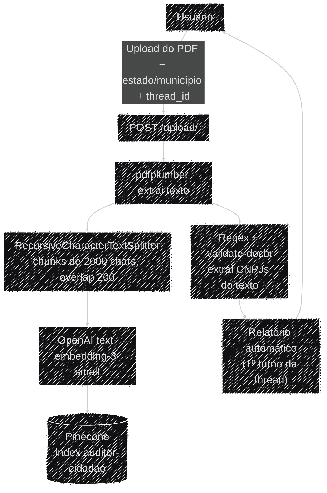
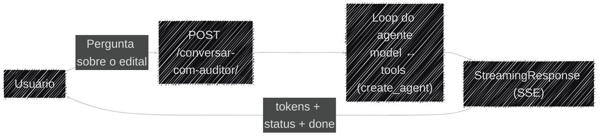
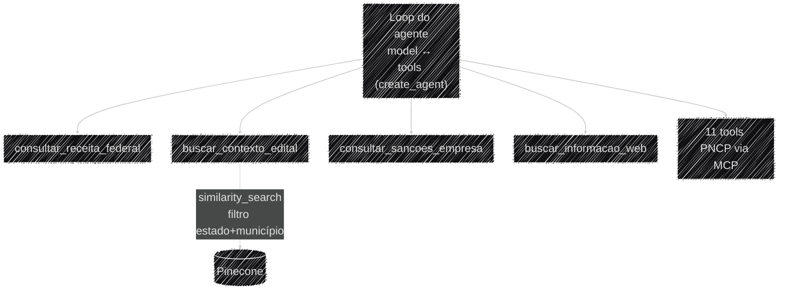

# Fluxo de Dados

Esta página detalha, ponta a ponta, os dois pipelines de dados do Auditor Cidadão: a ingestão de
um edital (upload) e a conversa com o agente (pergunta → laudo).

## Ingestão do edital (`POST /upload/`)

O PDF é lido inteiro em memória (sem tocar disco), rejeitado com `415`/`413` se não for PDF ou
passar de 20 MB (`app/api/root_upload.py`), e tem o texto extraído via `pdfplumber`. O
`GerenciadorVetorial` chunkiza o texto (separadores hierárquicos: parágrafo → linha → frase →
palavra), gera os embeddings e faz o upsert no Pinecone com `estado`/`municipio`/`arquivo`
replicados como metadado em cada chunk — é esse metadado que permite filtrar a busca por edital
depois. Os CNPJs do texto são extraídos por regex e devolvidos ao frontend, que os reenvia em
cada pergunta subsequente.

Com a indexação concluída, `gerar_relatorio_inicial()` roda como o **primeiro turno** da thread
identificada pelo `thread_id` recebido no upload — sem esperar nenhuma pergunta do usuário — e
devolve um laudo completo já estruturado (ver
[Relatório Automático e Extração de Laudo](../ia/extracao_laudo.md)). Perguntas seguintes do usuário
em `/conversar-com-auditor/` reusam esse mesmo `thread_id` e continuam a mesma conversa no
checkpointer, em vez de começar do zero. Exemplo real de request/response (`curl`):
[Referência de API](../operacional/api.md#post-upload-indexar-um-edital).

## Conversa com o agente (`POST /conversar-com-auditor/`)

Esse fluxo é dividido em dois diagramas: o **caminho da requisição** (a "casca" — como a pergunta
entra e a resposta sai) e o **leque de ferramentas** que o agente pode acionar por dentro dela.
Juntos num diagrama só, ficavam grandes demais para ler; separados, cada um cabe numa leitura só.

### O caminho da requisição

A resposta é transmitida via Server-Sent Events (SSE): tokens de texto conforme são gerados, e
mensagens de status quando uma ferramenta é acionada (ex.: "Consultando Receita Federal..."). Não há
extração estruturada nem card de laudo nessa conversa — o único laudo estruturado da thread é o
[relatório automático](../ia/extracao_laudo.md) gerado uma vez, logo após o upload; ver também
[Visão Geral](visao_geral.md#streaming-o-que-sai-pelo-sse-de-conversa). Exemplo real do stream de
eventos (`curl -N` + o JSON completo de cada tipo de evento):
[Referência de API](../operacional/api.md#post-conversar-com-auditor-perguntar-sobre-o-edital).

### O que o agente pode acionar dentro do loop

O `StateGraph` decide sozinho quais dessas ferramentas chamar, em qualquer ordem e quantas vezes
forem necessárias, antes de responder — o funcionamento interno desse loop de decisão (`call_llm`
↔ `tool_node` ↔ `router`) está detalhado em
[Visão Geral](visao_geral.md#o-ciclo-de-decisao-do-agente).
