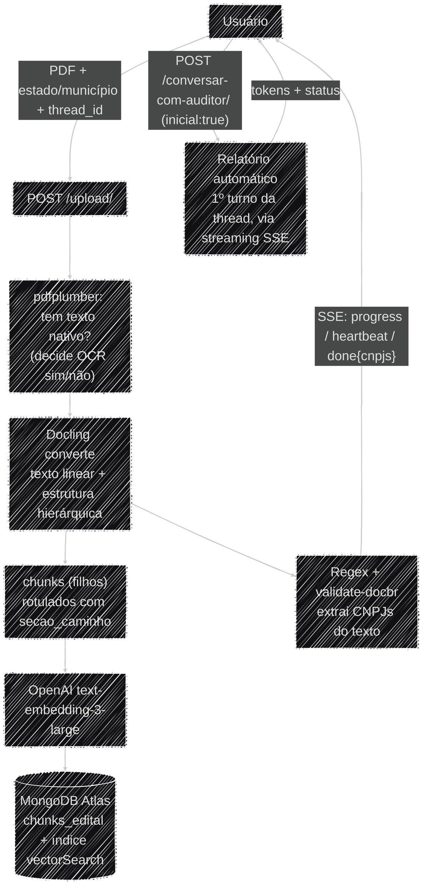
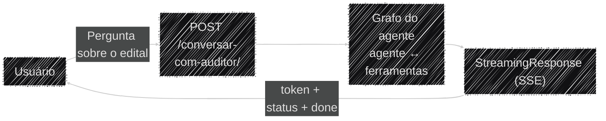
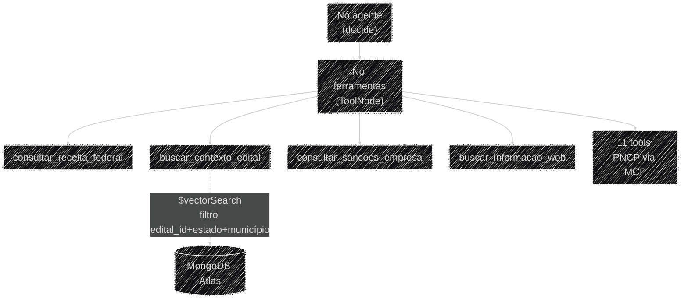

# Fluxo de Dados

Os dois pipelines do Auditor Cidadão, ponta a ponta: a ingestão de um edital (upload) e a conversa
com o agente (pergunta → laudo).

## Ingestão do edital (`POST /upload/`)

O PDF é lido inteiro em memória, sem tocar o disco. É rejeitado com `415` se não for PDF e `413` se
passar de 20 MB
([`app/api/endpoints/upload.py`](https://github.com/Moreira-89/auditor-cidadao/blob/main/backend/app/api/endpoints/upload.py)).
Uma checagem barata com `pdfplumber`
([`app/ingestion/pdf.py`](https://github.com/Moreira-89/auditor-cidadao/blob/main/backend/app/ingestion/pdf.py))
decide se o PDF é escaneado; em seguida o **Docling**
([`app/ingestion/pdf_hierarquico.py`](https://github.com/Moreira-89/auditor-cidadao/blob/main/backend/app/ingestion/pdf_hierarquico.py))
converte o documento — com ou sem OCR — devolvendo o texto linear (usado abaixo) e a estrutura
hierárquica de seções/blocos, que vira o RAG (ver abaixo). Os dois `DocumentConverter` ficam
pré-carregados no `lifespan`; a conversão roda em `asyncio.to_thread` e é o passo mais lento do
upload. Detalhes em [Uso de Dados e RAG](../ia/rag_dados.md#o-pipeline-de-indexacao).

`_indexar_hierarquico` (em `upload.py`) fatia cada bloco de conteúdo em chunks, embeda com a OpenAI
e grava tudo no MongoDB (`GerenciadorVetorial.indexar_hierarquia`) com `edital_id` (= `thread_id`) /
`estado` / `municipio` / `arquivo` no documento — é esse conjunto de campos que permite filtrar a
busca pelo edital certo. Detalhes e o schema completo em
[Uso de Dados e RAG](../ia/rag_dados.md).

Em paralelo, os CNPJs do texto são extraídos por regex e validados
([`app/ingestion/cnpj.py`](https://github.com/Moreira-89/auditor-cidadao/blob/main/backend/app/ingestion/cnpj.py)).

**A resposta do `/upload/` é um stream SSE.** Extração + indexação levam ~2 min; um request síncrono
todo esse tempo era derrubado por timeout de conexão ociosa (`Failed to fetch` no navegador, mesmo
com o backend terminando bem). Agora `_stream_indexacao` roda as etapas pesadas em `asyncio.to_thread`
e emite eventos enquanto elas rodam: `progress` (troca de etapa, com um `pct` para a barra),
`heartbeat` (a cada ~3 s, só para o socket não ficar ocioso), e no fim `done` com os CNPJs ou
`error`. As validações baratas (tipo, tamanho) ainda respondem `415`/`413` **antes** de o stream
começar.

O **relatório automático não roda dentro do `/upload/`**. No `done`, o frontend manda o usuário para
o chat e dispara o primeiro turno via `POST /conversar-com-auditor/` com `inicial: true` — o backend
usa `PROMPT_RELATORIO_INICIAL` no lugar da pergunta, e o laudo entra pelo streaming SSE, como
qualquer turno. Reusa o `thread_id` do upload, então continua a mesma thread no checkpointer.

Exemplo do stream: [Referência de API](../operacional/api.md#post-upload-indexar-um-edital).

!!! note "O Docling ainda roda dentro do request"
    O stream mantém a conexão viva, mas a conversão do Docling (~2 min em CPU) continua no caminho da
    requisição — só não derruba mais a conexão. Movê-la para um job de background (o `/upload/`
    respondendo em segundos, indexação assíncrona) é o passo seguinte (ver roadmap, Seção C).

## Conversa com o agente (`POST /conversar-com-auditor/`)

Dividida em dois diagramas: o **caminho da requisição** (como a pergunta entra e a resposta sai) e o
**leque de ferramentas** que o agente pode acionar por dentro dela.

### O caminho da requisição

O endpoint
([`app/api/endpoints/chat.py`](https://github.com/Moreira-89/auditor-cidadao/blob/main/backend/app/api/endpoints/chat.py))
é uma casca fina: valida o corpo com `PerguntaRequest`, aplica o rate limiter e entrega o gerador de
`run_agent()` a um `StreamingResponse`. A resposta é transmitida via Server-Sent Events — tokens
conforme são gerados e mensagens de status quando uma ferramenta é acionada (ex.: *"🏛️ Consultando
dados cadastrais na Receita Federal..."*).

Nenhum turno de produção faz extração estruturada — nem as perguntas comuns nem o
[relatório automático](../ia/extracao_laudo.md), que hoje é só o primeiro turno da thread, streamado
igual aos outros. Detalhes do stream em
[Visão Geral](visao_geral.md#streaming-o-que-sai-pelo-sse-de-conversa), e o JSON completo de cada
tipo de evento em
[Referência de API](../operacional/api.md#post-conversar-com-auditor-perguntar-sobre-o-edital).

### O que o agente pode acionar dentro do ciclo

O nó `agente` decide sozinho quais ferramentas chamar, em qualquer ordem e quantas vezes forem
necessárias, antes de responder. O funcionamento desse ciclo está em
[Visão Geral](visao_geral.md#o-grafo-do-agente).

Toda chamada de ferramenta passa antes pelo cache no Redis (TTL 24h) — uma consulta repetida ao
mesmo CNPJ dentro do dia não gera tráfego novo para a fonte externa. Ver
[Cache das ferramentas](protocolo_mcp.md#cache-das-ferramentas-aplicar_cache).
