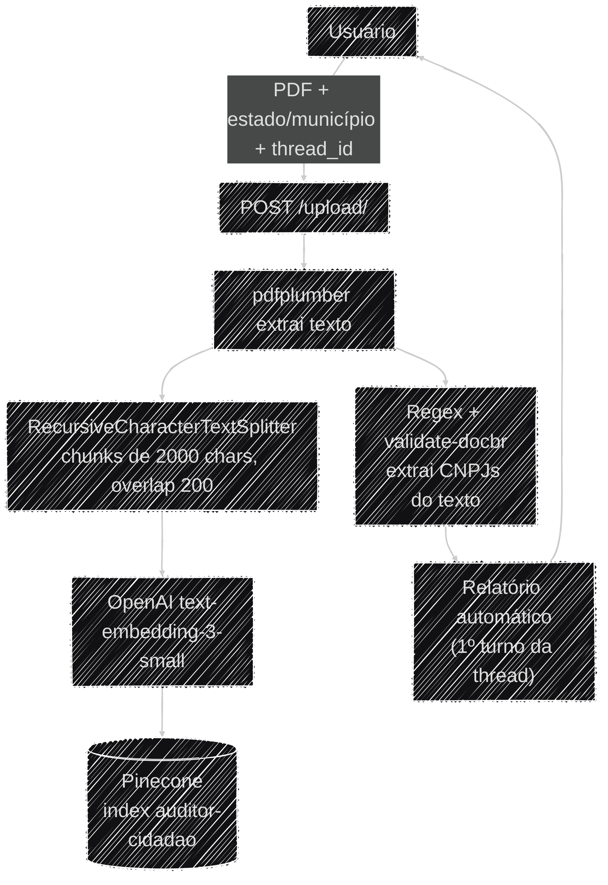
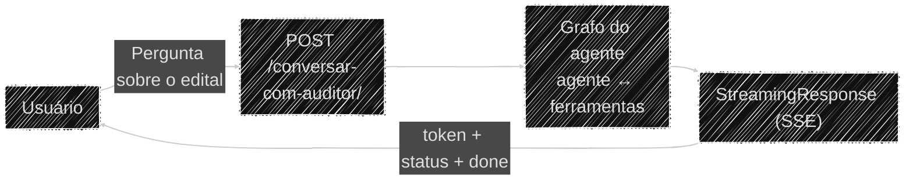
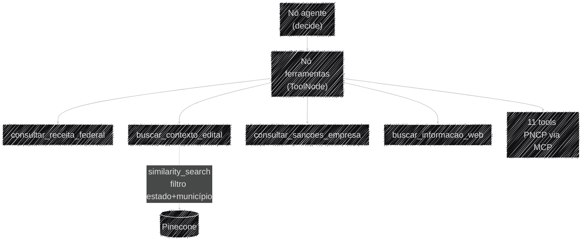

# Fluxo de Dados

Os dois pipelines do Auditor Cidadão, ponta a ponta: a ingestão de um edital (upload) e a conversa
com o agente (pergunta → laudo).

## Ingestão do edital (`POST /upload/`)

O PDF é lido inteiro em memória, sem tocar o disco. É rejeitado com `415` se não for PDF e `413` se
passar de 20 MB
([`app/api/endpoints/upload.py`](https://github.com/Moreira-89/auditor-cidadao/blob/main/backend/app/api/endpoints/upload.py)),
e tem o texto extraído por `pdfplumber`
([`app/ingestion/pdf.py`](https://github.com/Moreira-89/auditor-cidadao/blob/main/backend/app/ingestion/pdf.py)).

O `GerenciadorVetorial`
([`app/storage/vetorial.py`](https://github.com/Moreira-89/auditor-cidadao/blob/main/backend/app/storage/vetorial.py))
chunkiza o texto com separadores hierárquicos (parágrafo → linha → frase → palavra), gera os
embeddings e faz o upsert no Pinecone replicando `estado`/`municipio`/`arquivo` como metadado em
cada chunk — é esse metadado que permite filtrar a busca pelo edital certo depois.

Em paralelo, os CNPJs do texto são extraídos por regex e validados
([`app/ingestion/cnpj.py`](https://github.com/Moreira-89/auditor-cidadao/blob/main/backend/app/ingestion/cnpj.py)),
e devolvidos ao frontend, que os reenvia em cada pergunta seguinte.

Com a indexação concluída, `gerar_relatorio_inicial()`
([`app/agents/relatorio.py`](https://github.com/Moreira-89/auditor-cidadao/blob/main/backend/app/agents/relatorio.py))
roda como o **primeiro turno** da thread identificada pelo `thread_id` recebido no upload — sem
esperar nenhuma pergunta — e devolve um laudo já estruturado (ver
[Relatório Automático e Extração de Laudo](../ia/extracao_laudo.md)). Perguntas seguintes em
`/conversar-com-auditor/` reusam esse mesmo `thread_id` e continuam a conversa no checkpointer, em
vez de começar do zero.

Exemplo real de request/response: [Referência de API](../operacional/api.md#post-upload-indexar-um-edital).

!!! warning "Esta requisição é longa por natureza"
    O relatório automático executa um turno completo do agente — várias chamadas de LLM e de tools,
    com `recursion_limit=50` — **dentro** do request HTTP de upload, antes da resposta sair. Some-se
    a isso a indexação no Pinecone. O cliente segura a conexão durante todo esse tempo sem receber
    sinal de progresso, o que a torna sensível a timeout de proxy em editais grandes.

## Conversa com o agente (`POST /conversar-com-auditor/`)

Dividida em dois diagramas: o **caminho da requisição** (como a pergunta entra e a resposta sai) e o
**leque de ferramentas** que o agente pode acionar por dentro dela.

### O caminho da requisição

O endpoint
([`app/api/endpoints/chat.py`](https://github.com/Moreira-89/auditor-cidadao/blob/main/backend/app/api/endpoints/chat.py))
é uma casca fina: valida o corpo com `PerguntaRequest`, aplica o rate limiter e entrega o gerador de
`run_agent()` a um `StreamingResponse`. A resposta é transmitida via Server-Sent Events — tokens
conforme são gerados e mensagens de status quando uma ferramenta é acionada (ex.: *"🏛️ Consultando
dados cadastrais na Receita Federal..."*).

Não há extração estruturada nessa conversa; o único laudo estruturado da thread é o
[relatório automático](../ia/extracao_laudo.md) do upload. Detalhes do stream em
[Visão Geral](visao_geral.md#streaming-o-que-sai-pelo-sse-de-conversa), e o JSON completo de cada
tipo de evento em
[Referência de API](../operacional/api.md#post-conversar-com-auditor-perguntar-sobre-o-edital).

### O que o agente pode acionar dentro do ciclo

O nó `agente` decide sozinho quais ferramentas chamar, em qualquer ordem e quantas vezes forem
necessárias, antes de responder. O funcionamento desse ciclo está em
[Visão Geral](visao_geral.md#o-grafo-do-agente).

Toda chamada de ferramenta passa antes pelo cache no Redis (TTL 24h) — uma consulta repetida ao
mesmo CNPJ dentro do dia não gera tráfego novo para a fonte externa. Ver
[Cache das ferramentas](protocolo_mcp.md#cache-das-ferramentas-aplicar_cache).
