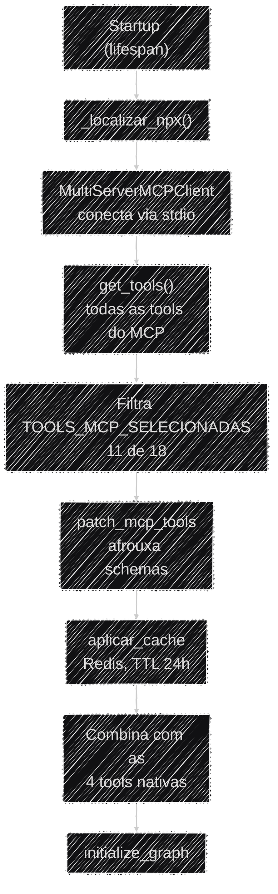

# Protocolo MCP

Além das 4 ferramentas nativas, o agente ganha 11 ferramentas de consulta ao **PNCP** (Portal
Nacional de Contratações Públicas) sem que uma linha de integração com o PNCP exista no
repositório — elas vêm de um servidor **MCP** externo. Esta página cobre o protocolo, os dois
ajustes de compatibilidade que ele exigiu e o cache que envolve todas as ferramentas do sistema.

## O que é MCP e por que usá-lo

O **Model Context Protocol (MCP)** é um padrão aberto para expor ferramentas a um agente de IA. Em
vez de reimplementar a integração com a API do PNCP (paginação, schemas, filtros, tratamento de
erro), o Auditor Cidadão consome o pacote npm `@licinexusbr/mcp`, que já entrega essas ferramentas
prontas.

!!! note "Trade-off: 11 ferramentas prontas × dependência de subprocesso Node.js"
    Adotar o MCP significa reaproveitar 11 ferramentas de PNCP validadas em vez de escrever e
    manter essa integração internamente. O custo é uma dependência de runtime não-Python: o
    servidor MCP roda como subprocesso `npx @licinexusbr/mcp`, e por isso **o Node.js 20 é
    obrigatório** tanto no [Setup local](../operacional/setup_local.md) quanto na imagem Docker.
    Sem ele, o boot é abortado com erro explícito — fail-fast, de propósito.

## Como as ferramentas MCP entram no agente

Todo o carregamento acontece uma vez no startup, em
[`app/agents/tools/registry.py`](https://github.com/Moreira-89/auditor-cidadao/blob/main/backend/app/agents/tools/registry.py).



1. **Localiza o `npx`** (`registry.py:66`) — no Windows injeta o caminho do Node.js no `PATH` do
   processo; em qualquer plataforma, aborta o boot com erro claro se não encontrar.
2. **Conecta ao MCP** via `MultiServerMCPClient` (transporte `stdio`) e chama `get_tools()`.
3. **Filtra a whitelist** — só as 11 tools de `TOOLS_MCP_SELECIONADAS` (`registry.py:30`) entram no
   agente. Nome pedido que o servidor não expôs vira `WARNING` no log, com o nome exato.
4. **Aplica o patch de schema** (`patch_mcp_tools`, abaixo).
5. **Envolve com cache no Redis, TTL 24h** — o mesmo cache cobre as tools nativas.
6. **Combina** as 11 MCP com as 4 nativas e entrega ao grafo.

```
2026-08-26 15:49:34 | INFO | MCP conectado — 11/18 ferramentas selecionadas para o agente.
2026-08-26 15:49:34 | INFO | Total de ferramentas disponíveis para o agente: 15
```

!!! info "Nenhum subprocesso persistente para encerrar no shutdown"
    Na versão usada do `langchain-mcp-adapters` (0.3.0), o `MultiServerMCPClient` **não** mantém um
    subprocesso Node.js vivo entre chamadas — cada `get_tools()` e cada execução de ferramenta abre
    e fecha a própria sessão. Por isso o `lifespan` não faz cleanup explícito de MCP: não há
    recurso de longa duração para liberar.

## Ajuste de compatibilidade de tipos (`patch_mcp_tools`)

Um LLM frequentemente envia números como texto — `"2024"` em vez de `2024`. Isso cria um conflito
entre duas camadas de validação: o Pydantic, do lado Python, rejeitaria o texto antes mesmo de a
ferramenta ser chamada; e o servidor MCP (Node.js, validado via Zod) rejeitaria o texto do outro
lado.
[`app/agents/tools/mcp.py`](https://github.com/Moreira-89/auditor-cidadao/blob/main/backend/app/agents/tools/mcp.py)
resolve os dois pontos:

1. **Afrouxa o schema** — reconstrói o schema de cada tool tornando os tipos permissivos (`int`
   passa a aceitar `int | str`, `float` idem, `array` idem). O valor do LLM passa na validação do
   Pydantic em vez de ser barrado.
2. **Coage os valores de volta** — imediatamente antes de chamar o MCP, converte cada valor para o
   tipo do schema **original** (`"2024"` → `2024`), para o servidor Node.js aceitar.

O mesmo wrapper **trunca o retorno de cada tool em 4000 caracteres**: com várias chamadas MCP por
turno, retornos volumosos acumulam tokens rapidamente, elevando custo e degradando a atenção do
modelo.

## Cache das ferramentas (`aplicar_cache`)

Cada chamada MCP dispara uma requisição ao PNCP, e esses dados mudam pouco ao longo do dia.
[`app/agents/tools/cache.py`](https://github.com/Moreira-89/auditor-cidadao/blob/main/backend/app/agents/tools/cache.py)
guarda os resultados no **Redis** — no mesmo client compartilhado com o rate limiter — sob a chave
`mcp_cache:{nome_da_tool}_{MD5(argumentos)}`, com validade de 24h (`TTL_CACHE_TOOLS_SEGUNDOS`,
`registry.py:19`). O Redis expira a chave sozinho; não há limpeza manual.

O Redis é a escolha em vez de um cache em memória porque atende dois requisitos que um `TTLCache`
local não atende: sobreviver a restart e ser compartilhado entre as
[2 réplicas em produção](../operacional/docker.md#escalonamento-replicas-e-limites-de-recurso).

### Serialização com marcação de tipo

O Redis só guarda texto, mas o retorno de uma tool nem sempre é um `dict`/`list`. As tools MCP (via
`langchain-mcp-adapters`, que usa `response_format="content_and_artifact"`) devolvem uma **tupla**
`(conteúdo, artefato)`, e `json.loads` nunca reconstrói uma tupla — sempre devolve lista.

Adivinhar o tipo pela estrutura na leitura seria ambíguo (uma tool nativa poderia, por
coincidência, devolver uma lista de 2 elementos). Por isso o tipo é marcado explicitamente na
escrita:

```python title="app/agents/tools/cache.py"
{"__tipo__": "tupla", "valor": [...]}   # quando o resultado é uma tuple
{"__tipo__": "bruto", "valor": ...}     # dict, list, str — sem transformação
```

A leitura usa a marca para decidir se reconstrói a tupla, sem nunca inspecionar o dado em si.

### Normalização da chave (`normalizadores`)

A chave é calculada a partir dos argumentos **exatos** que o LLM envia — e o LLM não é determinístico
na formatação. As tools de CNPJ tiram a pontuação *dentro* da tool, ou seja, depois que a chave já
teria sido calculada. Sem tratamento, `"11.222.333/0001-81"` e `"11222333000181"` — a mesma
consulta — geram chaves diferentes e o cache nunca dá HIT entre uma formatação e outra.

`aplicar_cache` aceita `normalizadores: dict[str, dict[str, Callable]]` (`tool_name -> {arg: função}`),
aplicado **só para calcular a chave**, sem alterar o valor que chega à tool. O mapa é declarado em
`registry.py:58`, que é quem sabe o que é um CNPJ — `cache.py` permanece genérico:

```python title="app/agents/tools/registry.py:58-63"
CACHE_KEY_NORMALIZERS = {
    "consultar_receita_federal": {"cnpj": _normalizar_cnpj_para_cache},
    "consultar_sancoes_empresa": {"cnpj": _normalizar_cnpj_para_cache},
    "buscar_contexto_edital": {"runtime": _extrair_estado_municipio_para_cache},
    "buscar_informacao_web": {"runtime": _extrair_estado_municipio_para_cache},
}
```

!!! warning "`ToolRuntime` não é serializável em JSON — e por isso precisa de normalizador próprio"
    `buscar_contexto_edital` e `buscar_informacao_web` recebem o contexto geográfico via um
    parâmetro `runtime: ToolRuntime`, que é um objeto (`state`, `config`, `store`, `tools`...), não
    uma string. Sem tratamento, o cálculo da chave quebra com
    `TypeError: Object of type ToolRuntime is not JSON serializable` em **toda** chamada dessas duas
    tools.

    `_extrair_estado_municipio_para_cache` (`registry.py:49`) resolve extraindo só `estado` e
    `municipio` do `runtime.state`. Os dois **precisam** continuar na chave: a mesma pergunta em
    municípios diferentes tem que gerar MISS, nunca reaproveitar o resultado de outro edital.

### Reconstrução da tool e o `args_schema`

`StructuredTool` é imutável, então `aplicar_cache` reconstrói cada tool do zero
(`name`/`description`/`args_schema`/`coroutine` copiados um a um) em vez de só trocar a coroutine.

A anotação que dispara a injeção do `ToolRuntime` vive no `args_schema` — ela depende de esse
objeto sobreviver **por referência** na reconstrução. Se `aplicar_cache` um dia passar a
reconstruir o `args_schema` em vez de copiá-lo, a injeção quebra em silêncio: a tool passa a
receber `runtime=None`, sem erro explícito.

### Tolerância a falha do Redis

Se o Redis estiver indisponível, a chamada da tool não é derrubada: a falha é registrada com
`logger.exception` e a execução segue direto para a tool original, tanto na leitura (GET) quanto na
escrita (SET). A tool sempre responde — apenas sem o benefício do cache naquela chamada.

### Logs emitidos

| Evento | Nível | Quando |
|---|---|---|
| `Cache Redis aplicado a N ferramenta(s): ...` | INFO | Uma vez no startup, ao envolver as tools |
| `Cache HIT (Redis) \| tool=... \| chave=...` | INFO | Chave já existia — a tool original não foi chamada |
| `Cache MISS (Redis) \| tool=... \| chave=...` | INFO | Chave não existia — a tool original foi chamada |
| `Resultado gravado no Redis \| tool=... \| ttl=...` | DEBUG | Escrita concluída após um MISS |
| `Falha ao ler/gravar no Redis \| tool=...` | ERROR (com traceback) | Redis indisponível — a chamada seguiu sem cache |

## Rate limit do PNCP

A API do PNCP aplica um rate limit agressivo a nível de WAF: bloqueio de vários minutos após poucas
requisições simultâneas. O cache de 24h mitiga o caso comum — consultas repetidas sobre o mesmo
órgão ou contrato dentro de um dia não geram tráfego novo.

!!! info "Requisitos do case cobertos por este pilar"
    | Requisito | O que esta página resolve |
    |---|---|
    | **T3** — Uso de dados (preparação, armazenamento) | Cache TTL no Redis e truncamento de retorno |
    | **T5** — Arquitetura com agentes (trade-offs) | Reuso via MCP × dependência de Node.js; cache local × distribuído |
