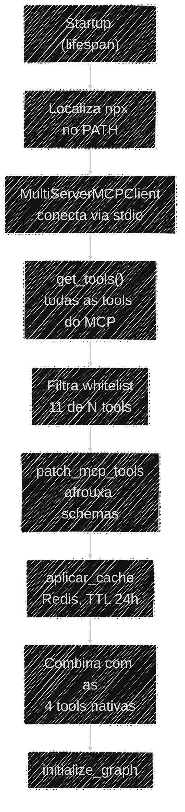

# Protocolo MCP

Além das 4 ferramentas nativas do projeto, o agente ganha 11 ferramentas de consulta ao **PNCP**
(Portal Nacional de Contratações Públicas) sem que uma linha de integração com o PNCP tenha sido
escrita no repositório — elas vêm de um servidor **MCP** externo. Esta página explica o que é esse
protocolo, por que o projeto o adota e os ajustes de compatibilidade que ele exigiu.

## O que é MCP e por que usá-lo

O **Model Context Protocol (MCP)** é um padrão aberto para expor ferramentas a um agente de IA. Em
vez de reimplementar toda a integração com a API do PNCP (paginação, schemas, filtros, tratamento
de erros), o Auditor Cidadão consome o pacote npm `@licinexusbr/mcp`, que já entrega essas
ferramentas prontas.

!!! note "Trade-off: reuso de 11 ferramentas prontas × dependência de subprocesso Node.js"
    Adotar o MCP significa reaproveitar 11 ferramentas de PNCP validadas em vez de escrever e manter
    essa integração internamente — um ganho grande de escopo para o prazo do projeto. O custo é uma
    dependência de runtime não-Python: o servidor MCP roda como um subprocesso Node.js
    (`npx @licinexusbr/mcp`), e é por isso que **o Node.js 20 é obrigatório** tanto no
    [Setup local](../operacional/setup_local.md) quanto na imagem Docker de produção. Sem ele, o
    `lifespan` falha ao conectar no MCP e o boot da aplicação é abortado (fail-fast, de propósito).

## Como as ferramentas MCP entram no agente

Todo o carregamento acontece uma única vez no startup, em `app/services/lifespan.py`:



As etapas, em detalhe:

1. **Localiza o `npx`** — no Windows injeta o caminho do Node.js no `PATH` do processo; em qualquer
   plataforma, aborta o boot com erro claro se o `npx` não for encontrado.
2. **Conecta ao MCP** via `MultiServerMCPClient` (transporte `stdio`) e chama `get_tools()`.
3. **Filtra a whitelist** — das ferramentas expostas pelo servidor, só 11 entram no agente
   (`search_licitacoes`, `search_contratos`, `get_contrato`, `list_contrato_termos`,
   `list_licitacao_arquivos`, `aggregate_licitacoes_por_periodo`, `get_licitacao`,
   `list_licitacao_itens`, `list_licitacao_resultados`, `search_atas_rp`, `compare_periodos`).
4. **Aplica o patch de schema** (`patch_mcp_tools`, ver abaixo).
5. **Envolve com cache no Redis, TTL de 24h** (`aplicar_cache`) — o mesmo cache também cobre as tools nativas.
6. **Combina** as 11 tools MCP com as 4 nativas e entrega tudo ao grafo.

!!! info "Nenhum subprocesso persistente para encerrar no shutdown"
    Na versão usada do `langchain-mcp-adapters` (0.3.0), o `MultiServerMCPClient` **não** mantém um
    subprocesso Node.js vivo entre chamadas — cada `get_tools()` e cada execução de ferramenta abre
    e fecha a própria sessão internamente. Por isso o `lifespan` não faz nenhum cleanup explícito de
    MCP no shutdown: não há recurso de longa duração para liberar.

## O ajuste de compatibilidade de tipos (`patch_mcp_tools`)

Um LLM frequentemente envia números como texto — `"2024"` em vez de `2024`. Isso cria um conflito
entre duas camadas de validação: o Pydantic do lado Python rejeitaria o texto antes mesmo de a
ferramenta ser chamada; e o servidor MCP (Node.js, validado via Zod) rejeitaria o texto do outro
lado. `app/utils/mcp_utils.py` resolve os dois pontos:

1. **Afrouxa o schema** — reconstrói o schema de cada tool tornando os tipos estritos permissivos
   (`int` passa a aceitar `int | str`, `float` idem, `array` idem). Assim o valor do LLM passa na
   validação do Pydantic em vez de ser barrado de cara.
2. **Coage os valores de volta** — logo antes de chamar o MCP, converte cada valor para o tipo
   nativo esperado pelo schema **original** (`"2024"` → `2024`), para o servidor Node.js aceitar.

O mesmo wrapper também **trunca o retorno de cada tool em 4000 caracteres** — com várias chamadas
MCP por turno, retornos volumosos acumulam tokens rapidamente, aumentando custo e podendo degradar
a atenção do modelo.

## Cache das ferramentas (`aplicar_cache`)

Cada chamada MCP dispara uma requisição ao PNCP, e esses dados mudam pouco ao longo do dia. O
`app/utils/cache_mcp.py` guarda os resultados no **Redis** (mesmo client `Redis` compartilhado com
o rate limiter — ver [Variáveis de ambiente](../operacional/variaveis_ambiente.md)), com chave
`mcp_cache:{nome_da_tool}_{MD5(argumentos)}` e validade de **24h** (`ex=` no `SET`, alinhada ao ciclo
de atualização do PNCP). O Redis expira a chave sozinho quando o TTL vence — não é preciso limpar
nada manualmente.

!!! note "Antes era em memória (`TTLCache`) — por que mudou"
    Até uma versão anterior, o cache vivia num `cachetools.TTLCache` dentro do próprio processo
    Python. Isso significava que o cache não sobrevivia a um restart do servidor e não seria
    compartilhado entre réplicas (cada uma cacheava por conta própria). Mover para o Redis resolve
    os dois pontos — pré-requisito para as 2 réplicas com que a aplicação roda em produção hoje
    (ver [Docker & Deploy](../operacional/docker.md#escalonamento-replicas-e-limites-de-recurso)) —,
    ao custo de uma serialização explícita — ver abaixo.

**Serialização com marcação de tipo.** O Redis só guarda texto — mas o retorno de uma tool não é
sempre um `dict`/`list` simples. As tools MCP (via `langchain-mcp-adapters`, que usa
`response_format="content_and_artifact"`) devolvem uma **tupla** `(conteúdo, artefato)`, e
`json.loads` nunca reconstrói uma tupla a partir de JSON — sempre devolve uma lista. Para não
depender de "adivinhar" o tipo pela estrutura na leitura (o que ficaria ambíguo se uma tool nativa
devolvesse, por coincidência, uma lista de 2 elementos de verdade), `_serializar`/`_desserializar`
marcam o tipo original explicitamente antes de gravar:

```python
{"__tipo__": "tupla", "valor": [...]}   # quando o resultado é uma tuple
{"__tipo__": "bruto", "valor": ...}     # dict, list, str — sem transformação
```

A leitura usa essa marca para decidir se reconstrói a tupla ou devolve o valor como veio — nunca
precisa inspecionar a estrutura do dado em si.

**Normalização da chave (`normalizadores`).** A chave é calculada a partir dos argumentos EXATOS
que o LLM decide enviar — mas o LLM não é determinístico na formatação. `consultar_receita_federal`
e `consultar_sancoes_empresa` tiram pontuação do CNPJ (`re.sub(r"[./-]", "", cnpj)`) **dentro** da
tool, em `app/services/tools.py`, ou seja, depois que a chave de cache já teria sido calculada.
Sem tratamento, `"11.222.333/0001-81"` e `"11222333000181"` — a mesma consulta — geram chaves
diferentes e o cache nunca dá HIT entre uma formatação e outra. `aplicar_cache` aceita um parâmetro
opcional `normalizadores: dict[str, dict[str, Callable]]` (`tool_name -> {arg_nome: função}`) que
`_gerar_chave` aplica **só para calcular a chave**, sem alterar o valor que de fato chega à tool.
`app/services/tools.py` declara esse mapa (`CACHE_KEY_NORMALIZERS`) porque é quem já sabe como cada
CNPJ precisa ser normalizado — `cache_mcp.py` continua genérico, sem saber o que é um CNPJ.

**Tolerância a falha do Redis.** Se o Redis estiver indisponível, `coroutine_com_cache` não derruba
a chamada da tool: registra a falha (`logger.exception`) e segue direto para a tool original, tanto
na leitura (GET) quanto na escrita (SET) — a tool sempre responde, só sem o benefício do cache
naquela chamada.

**Logs emitidos** (via `app/core/logging_config.py`), para acompanhar o comportamento em produção:

| Evento | Nível | Quando |
|---|---|---|
| `Cache Redis aplicado a N ferramenta(s): ...` | INFO | Uma vez no startup, ao envolver as tools |
| `Cache HIT (Redis) \| tool=... \| chave=...` | INFO | A chave já existia no Redis — tool original não foi chamada |
| `Cache MISS (Redis) \| tool=... \| chave=...` | INFO | Chave não existia — tool original foi chamada |
| `Resultado gravado no Redis \| tool=... \| chave=... \| ttl=...` | DEBUG | Escrita no Redis concluída após um MISS |
| `Falha ao ler/gravar no Redis \| tool=... \| chave=...` | ERROR (com traceback) | Redis indisponível — a chamada seguiu sem cache |

!!! info "Requisitos cobertos por este pilar"
    | Requisito | O que esta seção resolve |
    |---|---|
    | **T3** — Uso de dados (preparação, armazenamento) | Cache TTL no Redis e truncamento de retorno |
    | **T5** — Arquitetura com agentes (trade-offs) | Reuso via MCP × dependência de Node.js; cache local × cache distribuído |

## Limitações e observações

- **Rate limit do PNCP.** A API do PNCP tem um rate limit agressivo a nível de WAF (bloqueio de
  minutos após poucos requests simultâneos). O cache de 24h mitiga o caso comum; o comportamento do
  WAF está documentado como comentário em `app/services/consulta_pncp.py`.
- **Uma ferramenta de PNCP nativa ficou desativada** por causa desse rate limit
  (`buscar_contratos_fornecedor_pncp`) — ver detalhes em [Visão Geral](visao_geral.md).
