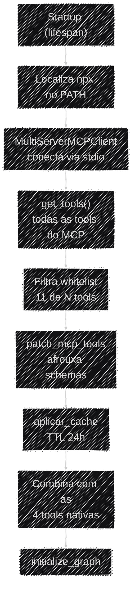

# Protocolo MCP

Além das 4 ferramentas nativas do projeto, o agente ganha 11 ferramentas de consulta ao **PNCP**
(Portal Nacional de Contratações Públicas) sem que uma linha de integração com o PNCP tenha sido
escrita no repositório — elas vêm de um servidor **MCP** externo. Esta página explica o que é esse
protocolo, por que o projeto o adota e os ajustes de compatibilidade que ele exigiu.

## O que é MCP e por que usá-lo

O **Model Context Protocol (MCP)** é um padrão aberto para expor ferramentas a um agente de IA. Em
vez de reimplementar toda a integração com a API do PNCP (paginação, schemas, filtros, tratamento
de erros), o Auditor Cidadão consome o pacote npm `@licinexusbr/mcp`, que já entrega essas
ferramentas prontas.

!!! note "Trade-off: reuso de 11 ferramentas prontas × dependência de subprocesso Node.js"
    Adotar o MCP significa reaproveitar 11 ferramentas de PNCP validadas em vez de escrever e manter
    essa integração internamente — um ganho grande de escopo para o prazo do projeto. O custo é uma
    dependência de runtime não-Python: o servidor MCP roda como um subprocesso Node.js
    (`npx @licinexusbr/mcp`), e é por isso que **o Node.js 20 é obrigatório** tanto no
    [Setup local](../operacional/setup_local.md) quanto na imagem Docker de produção. Sem ele, o
    `lifespan` falha ao conectar no MCP e o boot da aplicação é abortado (fail-fast, de propósito).

## Como as ferramentas MCP entram no agente

Todo o carregamento acontece uma única vez no startup, em `app/services/lifespan.py`:

As etapas, em detalhe:

1. **Localiza o `npx`** — no Windows injeta o caminho do Node.js no `PATH` do processo; em qualquer
   plataforma, aborta o boot com erro claro se o `npx` não for encontrado.
2. **Conecta ao MCP** via `MultiServerMCPClient` (transporte `stdio`) e chama `get_tools()`.
3. **Filtra a whitelist** — das ferramentas expostas pelo servidor, só 11 entram no agente
   (`search_licitacoes`, `search_contratos`, `get_contrato`, `list_contrato_termos`,
   `list_licitacao_arquivos`, `aggregate_licitacoes_por_periodo`, `get_licitacao`,
   `list_licitacao_itens`, `list_licitacao_resultados`, `search_atas_rp`, `compare_periodos`).
4. **Aplica o patch de schema** (`patch_mcp_tools`, ver abaixo).
5. **Envolve com cache TTL de 24h** (`aplicar_cache`) — o mesmo cache também cobre as tools nativas.
6. **Combina** as 11 tools MCP com as 4 nativas e entrega tudo ao grafo.

!!! info "Nenhum subprocesso persistente para encerrar no shutdown"
    Na versão usada do `langchain-mcp-adapters` (0.3.0), o `MultiServerMCPClient` **não** mantém um
    subprocesso Node.js vivo entre chamadas — cada `get_tools()` e cada execução de ferramenta abre
    e fecha a própria sessão internamente. Por isso o `lifespan` não faz nenhum cleanup explícito de
    MCP no shutdown: não há recurso de longa duração para liberar.

## O ajuste de compatibilidade de tipos (`patch_mcp_tools`)

Um LLM frequentemente envia números como texto — `"2024"` em vez de `2024`. Isso cria um conflito
entre duas camadas de validação: o Pydantic do lado Python rejeitaria o texto antes mesmo de a
ferramenta ser chamada; e o servidor MCP (Node.js, validado via Zod) rejeitaria o texto do outro
lado. `app/utils/mcp_utils.py` resolve os dois pontos:

1. **Afrouxa o schema** — reconstrói o schema de cada tool tornando os tipos estritos permissivos
   (`int` passa a aceitar `int | str`, `float` idem, `array` idem). Assim o valor do LLM passa na
   validação do Pydantic em vez de ser barrado de cara.
2. **Coage os valores de volta** — logo antes de chamar o MCP, converte cada valor para o tipo
   nativo esperado pelo schema **original** (`"2024"` → `2024`), para o servidor Node.js aceitar.

O mesmo wrapper também **trunca o retorno de cada tool em 4000 caracteres** — com várias chamadas
MCP por turno, retornos volumosos acumulam tokens rapidamente, aumentando custo e podendo degradar
a atenção do modelo.

## Cache das ferramentas (`aplicar_cache`)

Cada chamada MCP dispara uma requisição ao PNCP, e esses dados mudam pouco ao longo do dia. O
`app/utils/cache_mcp.py` guarda os resultados num `cachetools.TTLCache` em memória, com chave
`MD5(nome_da_tool + argumentos)` e validade de **24h** (alinhada ao ciclo de atualização do PNCP).
A escolha do `TTLCache` (em vez de um `dict` cru) importa: ele expira as entradas sozinho e respeita
um `maxsize`, evitando crescimento ilimitado de memória num servidor que fica dias no ar.

!!! info "Requisitos cobertos por este pilar"
    | Requisito | O que esta seção resolve |
    |---|---|
    | **T3** — Uso de dados (preparação, armazenamento) | Cache TTL e truncamento de retorno |
    | **T5** — Arquitetura com agentes (trade-offs) | Reuso via MCP × dependência de Node.js |

## Limitações e observações

- **Rate limit do PNCP.** A API do PNCP tem um rate limit agressivo a nível de WAF (bloqueio de
  minutos após poucos requests simultâneos). O cache de 24h mitiga o caso comum; o comportamento do
  WAF está documentado como comentário em `app/services/consulta_pncp.py`.
- **Uma ferramenta de PNCP nativa ficou desativada** por causa desse rate limit
  (`buscar_contratos_fornecedor_pncp`) — ver detalhes em [Visão Geral](visao_geral.md).
