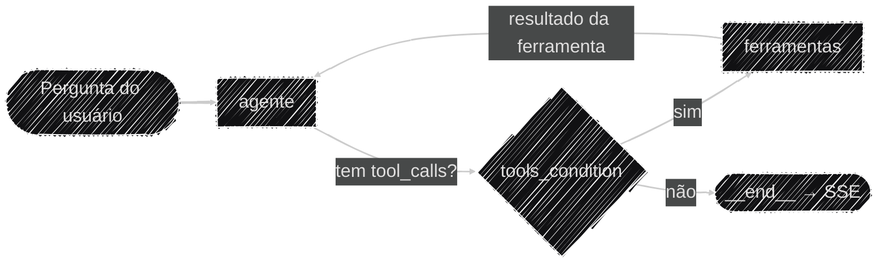

# Arquitetura do Sistema

Este pilar cobre a topologia **lógica** do Auditor Cidadão: como a pergunta de um usuário vira um
laudo de auditoria — o grafo do agente, o estado que ele carrega e as ferramentas que pode acionar.
Se você procura *onde* cada peça roda (Railway, container, serviços externos), isso está no pilar
[Operacional](../operacional/index.md); aqui o foco é o **raciocínio**, não a infraestrutura.

Todo o código do agente vive em
[`backend/app/agents/`](https://github.com/Moreira-89/auditor-cidadao/tree/main/backend/app/agents).

## O grafo do agente

O núcleo é um `StateGraph` do LangGraph montado explicitamente em
[`app/agents/graph.py`](https://github.com/Moreira-89/auditor-cidadao/blob/main/backend/app/agents/graph.py):
dois nós e uma aresta condicional entre eles, compilados uma vez no startup.

```python title="app/agents/graph.py:41-53"
grafo.add_node("agente", criar_no_agente(modelo))
# ToolNode executa a tool pedida e é quem injeta o ToolRuntime nas que o declaram.
grafo.add_node("ferramentas", ToolNode(tools))

grafo.add_edge(START, "agente")
# tools_condition devolve "tools" quando a última AIMessage traz tool_calls; o dict
# traduz esse retorno para o nome que o nó tem aqui.
grafo.add_conditional_edges(
    "agente", tools_condition, {"tools": "ferramentas", END: END}
)
grafo.add_edge("ferramentas", "agente")

return grafo.compile(checkpointer=checkpointer)
```



É o ciclo **ReAct**: o modelo decide, as ferramentas executam, o modelo lê o resultado e decide de
novo, até responder sem pedir mais nada. `recursion_limit=50` (definido nas chamadas em
[`conversa.py`](https://github.com/Moreira-89/auditor-cidadao/blob/main/backend/app/agents/conversa.py)
e [`relatorio.py`](https://github.com/Moreira-89/auditor-cidadao/blob/main/backend/app/agents/relatorio.py))
é o teto que impede um loop infinito entre os dois nós.

O desenho completo dos dois pipelines ponta a ponta está em [Fluxo de Dados](fluxo_dados.md).

### O nó `agente`

[`app/agents/nodes/agente.py`](https://github.com/Moreira-89/auditor-cidadao/blob/main/backend/app/agents/nodes/agente.py)
é o único ponto do projeto onde o modelo principal é invocado. É uma função-fábrica: recebe o
modelo já com `bind_tools` aplicado e devolve o nó, o que deixa a assinatura que o LangGraph
inspeciona reduzida a `(state)` e torna o nó testável passando qualquer modelo.

```python title="app/agents/nodes/agente.py:16-21"
async def no_agente(state: AgentState) -> dict:
    resposta = await modelo.ainvoke(
        [SystemMessage(content=SYSTEM_PROMPT), *state["messages"]]
    )
    return {"messages": [resposta]}
```

O `SYSTEM_PROMPT` é **preposto a cada chamada**, não gravado no histórico. Três consequências
diretas: ele não é persistido pelo checkpointer, não se duplica a cada turno, e uma alteração no
prompt vale imediatamente até para conversas já em andamento.

### O nó `ferramentas`

É o `ToolNode` de `langgraph.prebuilt`, sem customização. Além de executar a ferramenta pedida, é
ele quem **injeta o `ToolRuntime`** nas tools que declaram esse parâmetro — o mecanismo que leva o
contexto geográfico até a busca no Pinecone, descrito na seção seguinte.

## O estado do grafo (`AgentState`)

[`app/agents/state.py`](https://github.com/Moreira-89/auditor-cidadao/blob/main/backend/app/agents/state.py)
estende `MessagesState` do LangGraph — que já traz `messages` com o reducer `add_messages`, ou seja,
cada nó **anexa** ao histórico em vez de sobrescrevê-lo — com duas chaves próprias:

```python title="app/agents/state.py:4-16"
class AgentState(MessagesState):
    """Estado compartilhado entre os nós do grafo durante um turno de conversa."""

    estado: str
    municipio: str
```

`estado` e `municipio` são o contexto geográfico do edital em análise. Eles não fazem parte da
conversa e o LLM nunca os lê diretamente: quem os consome são as tools que declaram
`runtime: ToolRuntime`, lendo `runtime.state["estado"]`. É esse par que filtra a busca semântica
para o edital certo (ver [Uso de Dados e RAG](../ia/rag_dados.md)).

Como o checkpointer só persiste as chaves declaradas no schema, e quem sabe o estado/município é
quem chama o grafo, os dois são **reenviados a cada turno** —
[`conversa.py:103-111`](https://github.com/Moreira-89/auditor-cidadao/blob/main/backend/app/agents/conversa.py).

## Persistência da conversa (checkpointer)

Um `AsyncRedisSaver` guarda o histórico por `thread_id`, aberto em
[`app/storage/checkpointer.py`](https://github.com/Moreira-89/auditor-cidadao/blob/main/backend/app/storage/checkpointer.py)
e mantido vivo pelo `lifespan` durante toda a execução do processo. Isso faz a conversa sobreviver a
restarts e ficar acessível às duas réplicas em produção
(ver [Docker & Deploy](../operacional/docker.md#escalonamento-replicas-e-limites-de-recurso)).

A persistência não é indefinida. Cada thread expira após `TTL_CHECKPOINT_MINUTOS` de
**inatividade** (default 24h), e `refresh_on_read=True` renova essa contagem a cada leitura — uma
conversa em uso nunca expira no meio, só threads abandonadas são limpas.

```python title="app/storage/checkpointer.py:21"
ttl_config = {"default_ttl": TTL_CHECKPOINT_MINUTOS, "refresh_on_read": True}
```

O grafo só pode ser compilado **dentro** desse contexto — é ali que a conexão existe. Por isso o
`lifespan` ([`app/api/lifespan.py`](https://github.com/Moreira-89/auditor-cidadao/blob/main/backend/app/api/lifespan.py))
mantém o `async with` aberto envolvendo o `yield`:

```python title="app/api/lifespan.py:19-27"
async with abrir_client_redis() as redis_client:
    tools = await montar_tools(redis_client)
    inicializar_rate_limiter(redis_client)

    async with abrir_checkpointer() as checkpointer:
        initialize_graph(tools=tools, checkpointer=checkpointer)
        logger.info("Servidor pronto para receber requests.")

        yield
```

## Ferramentas disponíveis ao agente

| Origem | Ferramenta | O que faz |
|---|---|---|
| Nativa | [`consultar_receita_federal`](https://github.com/Moreira-89/auditor-cidadao/blob/main/backend/app/agents/tools/receita_federal.py) | Situação cadastral, CNAE, data de fundação (BrasilAPI) |
| Nativa | [`buscar_contexto_edital`](https://github.com/Moreira-89/auditor-cidadao/blob/main/backend/app/agents/tools/contexto_edital.py) | Busca semântica no edital indexado (Pinecone, RAG) |
| Nativa | [`consultar_sancoes_empresa`](https://github.com/Moreira-89/auditor-cidadao/blob/main/backend/app/agents/tools/sancoes.py) | Sanções ativas no CEIS/CNEP (Portal da Transparência) |
| Nativa | [`buscar_informacao_web`](https://github.com/Moreira-89/auditor-cidadao/blob/main/backend/app/agents/tools/busca_web.py) | Contexto complementar via Tavily |
| MCP (`@licinexusbr/mcp`) | 11 tools de PNCP | Licitações, contratos, itens, resultados, atas de RP — ver [Protocolo MCP](protocolo_mcp.md) |

Cada tool nativa é **um arquivo só**, contendo as duas metades: o `@tool` que o LLM enxerga (schema
`Annotated`/`Field`, a docstring — que é o texto lido pelo modelo para decidir se chama a
ferramenta —, validação de CNPJ e a tradução de falhas) e, abaixo, a função de rede pura, que
levanta exceção nativa e não sabe o que é um LLM.

Nenhuma tool nativa deixa exceção subir crua: todas devolvem `{"error": ...}` estruturado para o
LLM decidir como reagir, em vez de derrubar o turno.

!!! warning "A função registrada no grafo não é a que está no arquivo da tool"
    Antes de chegarem ao grafo, todas as tools passam por `aplicar_cache()` em
    [`app/agents/tools/registry.py`](https://github.com/Moreira-89/auditor-cidadao/blob/main/backend/app/agents/tools/registry.py),
    e o que o agente executa é o wrapper resultante. Ao depurar o comportamento de uma ferramenta,
    o `registry.py` é o segundo arquivo a abrir — ver
    [Cache das ferramentas](protocolo_mcp.md#cache-das-ferramentas-aplicar_cache).

### Montagem: `montar_tools()`

`registry.py` é o único lugar que responde "quais ferramentas o agente tem". Ele reúne as nativas,
conecta ao MCP, filtra a whitelist, aplica o patch de schema e envolve tudo com cache:

```python title="app/agents/tools/registry.py:147-163"
async def montar_tools(redis_client: Redis) -> list[BaseTool]:
    tools_mcp = await _obter_tools_mcp()

    tools = aplicar_cache(
        tools=TOOLS_NATIVAS,
        redis_client=redis_client,
        ttl_segundos=TTL_CACHE_TOOLS_SEGUNDOS,
        normalizadores=CACHE_KEY_NORMALIZERS,
    ) + aplicar_cache(
        tools=tools_mcp,
        redis_client=redis_client,
        ttl_segundos=TTL_CACHE_TOOLS_SEGUNDOS,
    )

    _conferir_mensagens_de_status(tools)
    logger.info("Total de ferramentas disponíveis para o agente: %d", len(tools))
    return tools
```

Duas verificações rodam no startup e transformam falhas silenciosas em avisos no log:

- **`_conferir_mensagens_de_status`** (`registry.py:126`) compara os nomes das tools montadas com as
  chaves de
  [`app/config/tool_status_map.py`](https://github.com/Moreira-89/auditor-cidadao/blob/main/backend/app/config/tool_status_map.py),
  nos dois sentidos. Sem ela, uma tool sem mensagem cai no fallback `"Analisando..."` do streaming
  sem que ninguém perceba, e uma entrada órfã no mapa fica invisível.
- **Whitelist MCP não atendida** (`registry.py:114`): se um nome de `TOOLS_MCP_SELECIONADAS` não
  vier do servidor — porque o pacote renomeou a ferramenta, por exemplo —, sai um `WARNING` com o
  nome exato. Sem isso, a ferramenta simplesmente desapareceria do agente.

## Os dois fluxos que chamam o grafo

O grafo tem dois consumidores, com necessidades opostas. Eles estão em arquivos separados porque
não compartilham nada além do envelope de mensagem.

| Arquivo | Entrada | Saída | Como chama o grafo |
|---|---|---|---|
| [`agents/conversa.py`](https://github.com/Moreira-89/auditor-cidadao/blob/main/backend/app/agents/conversa.py) | Pergunta do usuário | Markdown em streaming (SSE) | `astream_events()` |
| [`agents/relatorio.py`](https://github.com/Moreira-89/auditor-cidadao/blob/main/backend/app/agents/relatorio.py) | Disparo automático pós-upload | JSON estruturado, síncrono | `ainvoke()` + extrator |

O que os dois compartilham vive em
[`agents/envelope.py`](https://github.com/Moreira-89/auditor-cidadao/blob/main/backend/app/agents/envelope.py):
`escape_xml()` (guardrail anti prompt-injection, ver [Guardrails](../governanca/guardrails.md)) e
`montar_primeiro_turno()`, que monta o `PROMPT_DINAMICO` com CNPJs, estado, município e data — o
primeiro `HumanMessage` de toda thread nova, seja ela aberta por uma pergunta ou pelo relatório
automático.

### Streaming: o que sai pelo SSE de conversa

`run_agent()` consome `grafo.astream_events(version="v2")` e traduz dois tipos de evento do grafo
em eventos SSE:

```python title="app/agents/conversa.py:112-127"
if evento["event"] == "on_chat_model_stream":
    # getattr com default: chunks intermediários podem não ter o atributo tool_calls
    chunk = evento["data"].get("chunk")
    if chunk is not None and chunk.content and not getattr(chunk, "tool_calls", None):
        yield _sse("token", chunk.content)

elif evento["event"] == "on_tool_start":
    yield _sse("status", TOOL_STATUS_MAP.get(evento["name"], "Analisando..."))

yield _sse("done")
```

O filtro `not getattr(chunk, "tool_calls", None)` é o que impede que fragmentos de uma chamada de
ferramenta apareçam como texto na tela do usuário. `evento["name"]`, no `on_tool_start`, é o nome da
**tool** — a chave do `TOOL_STATUS_MAP`.

Essa conversa não faz extração estruturada: a resposta chega ao frontend como Markdown livre. O
único laudo estruturado de uma thread é o
[relatório automático](../ia/extracao_laudo.md) gerado uma vez, logo após o upload.

!!! note "Histórico interrompido no meio de uma `tool_call`"
    Se o usuário interromper a execução de uma ferramenta, o checkpointer fica com uma `AIMessage`
    cujos `tool_calls` nunca foram respondidos — e a OpenAI rejeita qualquer mensagem nova nessa
    thread com `400` enquanto isso não for corrigido.

    `_curar_tool_calls_pendentes()`
    ([`conversa.py:15`](https://github.com/Moreira-89/auditor-cidadao/blob/main/backend/app/agents/conversa.py))
    detecta esse estado no início do próximo turno: compara os `tool_calls` da última `AIMessage`
    com os `tool_call_id` já respondidos e injeta uma `ToolMessage` sintética
    (`"Chamada cancelada..."`) para cada pendência, via `grafo.aupdate_state()`. O histórico volta a
    ser válido sem descartar a conversa.

## Limitações conhecidas

As limitações desta arquitetura — incluindo o alcance real do rate limiting e o que o sistema
sinaliza mas não prova — estão consolidadas em
[Limitações conhecidas](../governanca/limitacoes.md), junto das demais.
