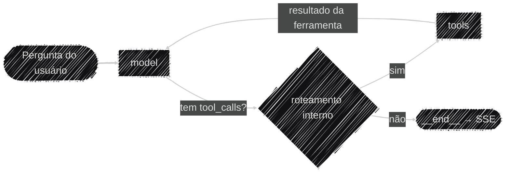

# Arquitetura do Sistema

Este pilar cobre a topologia **lógica** do Auditor Cidadão: como o pedido de um usuário vira um
laudo de auditoria — o ciclo do agente, as ferramentas disponíveis e o pipeline de RAG. Se você
procura *onde* cada peça roda (Railway, container, serviços externos), isso já está no pilar
[Operacional](../operacional/index.md); aqui o foco é o **raciocínio**, não a infraestrutura.

## O ciclo de decisão do agente

O núcleo do sistema é um agente `create_agent` (`langchain.agents`, montado em
`app/services/build_graph.py`): internamente ainda é um `StateGraph` do LangGraph, mas
construído pela lib em vez de montado nó a nó à mão — o agente alterna entre um nó `model`
e um nó `tools` até o modelo responder sem pedir mais nenhuma ferramenta, incluindo o
roteamento por `tool_calls` e o `bind_tools`, que `create_agent` já faz sozinho. Um
`AsyncRedisSaver` (Redis, ver `app/services/lifespan.py`) guarda esse histórico por `thread_id`,
persistindo entre restarts e compartilhado entre as réplicas com que a aplicação roda em produção
hoje (2 réplicas, 1 worker cada, ver [Docker & Deploy](../operacional/docker.md#escalonamento-replicas-e-limites-de-recurso)) —
substituiu o `InMemorySaver` original (RAM do processo, perdido a cada restart). A persistência não
é indefinida: cada thread expira após `TTL_CHECKPOINT_MINUTOS` minutos de **inatividade** (default
24h) — toda leitura renova essa contagem, então uma conversa em uso nunca expira no meio, só threads
abandonadas são limpas (ver [Variáveis de ambiente](../operacional/variaveis_ambiente.md)).

Este é só o ciclo de decisão — o desenho completo dos dois pipelines ponta a ponta (upload de
edital e conversa, incluindo as ferramentas e o streaming) está em
[Fluxo de Dados](fluxo_dados.md).

!!! note "Migração de StateGraph manual para create_agent"
    Até uma versão anterior, esse ciclo era um `StateGraph` montado nó a nó à mão (`call_llm`,
    `tool_node`, um `router` condicional escrito no projeto, `bind_tools` chamado explicitamente).
    Era um bom exercício para entender o mecanismo por baixo do capô, mas reimplementava algo que o
    LangChain 1.x já oferece pronto via `create_agent` — mesmo loop ReAct, mesmas customizações que o
    projeto precisa (`state_schema` próprio para `estado`/`municipio`, `checkpointer`, `system_prompt`),
    numa fração do código. A migração preservou a assinatura de `build_graph()` (mesmos parâmetros,
    mesmo retorno) para não exigir mudanças em quem já a chamava (`lifespan.py`,
    `evaluation/pipeline_avaliacao.py`), e o `SYSTEM_PROMPT` deixou de ser injetado manualmente como
    `SystemMessage` no primeiro turno — `create_agent` o prepõe automaticamente a cada chamada ao
    modelo via `system_prompt=`.

!!! note "Essa estrutura de dois nós é propositalmente simples — e já tem expansão planejada"
    Hoje o agente é o padrão ReAct mínimo: um único nó `model` decidindo tudo e um único nó `tools`
    executando qualquer ferramenta. Isso funciona bem no tamanho atual, mas fica difícil de ler
    num diagrama conforme mais ferramentas e mais micro-programas Python (processamento
    determinístico fora do ciclo de decisão do LLM — pequenas automações, análises que não
    precisam passar pelo modelo) entrarem no fluxo. O roadmap já prevê separar esse ciclo em nós
    dedicados (ou middleware, ver abaixo) — por exemplo, um nó só de decisão/orquestração, outro só
    de geração final, mais nós de processamento determinístico à parte. Não é correção de bug — é
    uma melhoria de manutenibilidade e clareza planejada para a V2.

## O estado do grafo (`AgentState`)

`app/models/agent_state.py` estende o `AgentState` de `langchain.agents` (que já traz `messages`
com o reducer `add_messages` — cada nó **anexa**, nunca sobrescreve) com duas chaves próprias:
`estado` e `municipio`, o contexto geográfico do edital em análise. Tools que declaram um parâmetro
`runtime: ToolRuntime` recebem esse contexto via `runtime.state["estado"]`/`runtime.state["municipio"]`
— por isso as duas chaves precisam existir no `AgentState`, mesmo não fazendo parte da conversa em
si: é assim que o LangGraph sabe de onde tirar o valor para a tool.

!!! note "`estado`/`municipio` têm vida útil planejada até a V2"
    Essas duas chaves existem porque, hoje, o usuário informa manualmente o estado e o município ao
    indexar um edital, e esse par é o metadado usado para filtrar a busca no Pinecone (ver
    [Uso de Dados e RAG](../ia/rag_dados.md)). O roadmap já prevê, num futuro não tão distante, a
    indexação automática via PNCP (sem upload manual) e, junto dela, uma migração do schema de
    metadado do Pinecone de `municipio`/`estado` para **`cnpjs`** (lista extraída automaticamente do
    edital). Quando isso
    acontecer, o `AgentState` deixa de carregar `estado`/`municipio` e passa a carregar `cnpjs`,
    já que é esse o novo campo que as tools precisarão ler via `ToolRuntime`. Essa mudança
    também é o que viabiliza a tool `buscar_historico_empresa` planejada para a V2 (cruzamento de
    um CNPJ entre editais de municípios diferentes já indexados) — hoje impossível, porque a busca
    é isolada por município.

## Ferramentas disponíveis ao agente

| Origem | Ferramenta | O que faz |
|---|---|---|
| Nativa | `consultar_receita_federal` | Situação cadastral, CNAE, data de fundação (BrasilAPI) |
| Nativa | `buscar_contexto_edital` | Busca semântica no edital indexado (Pinecone, RAG) |
| Nativa | `consultar_sancoes_empresa` | Sanções ativas no CEIS/CNEP (Portal da Transparência) |
| Nativa | `buscar_informacao_web` | Contexto complementar via Tavily |
| MCP (`@licinexusbr/mcp`) | 11 tools de PNCP | Licitações, contratos, itens, resultados, atas de RP — carregadas e filtradas no startup (ver `app/services/lifespan.py`) |

Todas as tools nativas seguem o mesmo padrão: nunca deixam uma exceção subir crua, sempre
devolvem `{"error": ...}` estruturado para o LLM decidir como reagir, em vez de derrubar o turno.

!!! note "Migração de InjectedState para ToolRuntime"
    Até uma versão anterior, `buscar_contexto_edital` e `buscar_informacao_web` recebiam
    `estado`/`municipio` via `InjectedState("estado")`/`InjectedState("municipio")` (`langgraph.prebuilt`)
    — um parâmetro anotado por chave. O idioma do LangChain 1.x é o parâmetro único
    `runtime: ToolRuntime` (`langchain.tools`), que expõe `state`, `config`, `store` e mais num
    objeto só. A migração expôs um bug real, não hipotético: `ToolRuntime` não é serializável em
    JSON, e o cache de tools (`aplicar_cache`, ver [Protocolo MCP](protocolo_mcp.md#cache-das-ferramentas-aplicar_cache))
    tentava serializar todos os argumentos — incluindo o `runtime` — para calcular a chave de cache,
    quebrando com `TypeError` em toda chamada dessas duas tools. Corrigido com um normalizador que
    extrai só `estado`/`municipio` do `runtime.state` antes de calcular a chave, preservando a
    correção original (município diferente → chave diferente).

!!! note "Uma quinta tool nativa existe, mas está desativada de propósito"
    `buscar_contratos_fornecedor_pncp` (cruza fornecedor + órgão contratante no PNCP) está
    implementada em `tools.py`, mas fora da lista `TOOLS` e do `SYSTEM_PROMPT`. Motivo: varrer
    todas as modalidades de contratação de um órgão pode levar minutos sob o rate limit do PNCP, e
    o streaming SSE não emite nenhum evento durante a execução de uma tool — arriscando ser
    encerrado por timeout de proxy antes de terminar. Documentado como limitação conhecida em vez
    de arriscar quebrar o streaming em produção — ainda estamos avaliando como reativá-la de forma
    segura (ex.: heartbeats periódicos no SSE ou uma varredura de escopo mais restrito).

## Streaming: o que sai pelo SSE de conversa

`run_agent()` consome `grafo.astream_events()` e emite eventos SSE (`token`, `status`, `done`/
`error`) conforme o grafo executa — só repassa fragmentos de texto (`on_chat_model_stream`, filtrando
chunks que carregam `tool_calls` em vez de conteúdo final) e mensagens de status quando uma
ferramenta é acionada (`on_tool_start`). Diferente do relatório automático pós-upload (ver
[Relatório Automático e Extração de Laudo](../ia/extracao_laudo.md)), essa conversa não faz nenhuma
extração estruturada: a resposta chega ao frontend como Markdown livre, sem card de laudo — o único
laudo estruturado de uma thread é o gerado uma vez, logo após o upload.

!!! note "Histórico interrompido no meio de uma tool_call"
    Se o usuário interromper a execução de uma ferramenta, o
    checkpointer fica com uma `AIMessage` cujos `tool_calls` nunca foram respondidos — e a
    OpenAI rejeita qualquer mensagem nova nessa thread com `400` enquanto isso não for corrigido.
    `_curar_tool_calls_pendentes()` detecta esse estado no início do próximo turno e injeta
    `ToolMessage`s sintéticas ("chamada cancelada") para cada `tool_call` pendente, restaurando a
    validade do histórico sem descartar a conversa. Esse comportamento independe de qual
    checkpointer está por baixo (valia para o antigo `InMemorySaver` e continua valendo para o
    `AsyncRedisSaver` atual).

## Pontos de extensão: middleware (avaliado, adiado para V2)

`create_agent` expõe `middleware=` (`wrap_model_call`, `wrap_tool_call`, entre outros hooks) como o
mecanismo idiomático da lib para comportamento transversal — interceptar toda chamada ao modelo ou
toda chamada de ferramenta sem espalhar a lógica pelo código de negócio. Três pontos do projeto hoje
resolvidos "na mão" são candidatos naturais:

| Hoje (feito à mão) | Middleware equivalente | Onde |
|---|---|---|
| `_curar_tool_calls_pendentes` (repara histórico interrompido) | `wrap_model_call` (roda antes da chamada ao modelo) | `app/services/ai_engine.py` |
| `aplicar_cache` (cache de tool no Redis) | `wrap_tool_call` (intercepta a execução da tool) | `app/utils/cache_mcp.py` |
| `escape_xml` (guardrail anti prompt-injection) | `wrap_model_call` ou um middleware de input | `app/services/ai_engine.py` |

**Avaliado e adiado para V2, não implementado agora** — motivo: os três mecanismos atuais já
funcionam, já passaram pela avaliação do Bloco 4 e pela migração para `create_agent` sem regressão
(golden dataset), e migrar os três de uma vez é justamente o tipo de redesenho que vale fazer junto
com a separação de nós em [O ciclo de decisão do agente](#o-ciclo-de-decisao-do-agente) — não faz
sentido reformar a extensibilidade duas vezes (uma agora, incompleta, outra na V2 junto do resto).
`aplicar_cache` em particular tem uma complicação própria a resolver primeiro: hoje ele intercepta a
tool na composição da lista (`tools_nativas + mcp_tools`, ver `lifespan.py`), fora do grafo — virar
`wrap_tool_call` significaria mover essa composição para dentro de `create_agent`, o que só faz
sentido decidir junto da separação de nós, não isoladamente.

## Limitações conhecidas desta arquitetura

- **Grafo com apenas dois nós** — ver a expansão planejada logo acima, em
  [O ciclo de decisão do agente](#o-ciclo-de-decisao-do-agente).
- **Rate limiting por cookie, não por identidade real.** O `client_id` (ver
  [Limitações conhecidas](../governanca/limitacoes.md)) identifica o navegador, não a pessoa —
  limpar cookies, aba anônima ou outro navegador geram uma sessão nova e, portanto, uma quota nova.
