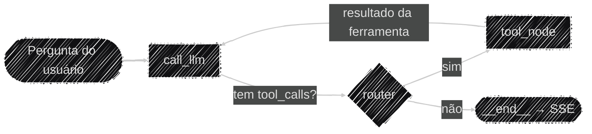

# Arquitetura do Sistema

Este pilar cobre a topologia **lógica** do Auditor Cidadão: como o pedido de um usuário vira um
laudo de auditoria — o ciclo do agente, as ferramentas disponíveis e o pipeline de RAG. Se você
procura *onde* cada peça roda (Railway, container, serviços externos), isso já está no pilar
[Operacional](../operacional/index.md); aqui o foco é o **raciocínio**, não a infraestrutura.

## O ciclo de decisão do agente

O núcleo do sistema é um `StateGraph` do LangGraph (`app/services/build_graph.py`): o agente
alterna entre `call_llm` e `tool_node` até o modelo responder sem pedir mais nenhuma ferramenta.
O roteador (`router`) decide isso checando se a última mensagem tem `tool_calls` pendentes. Um
`AsyncRedisSaver` (Redis, ver `app/services/lifespan.py`) guarda esse histórico por `thread_id`,
persistindo entre restarts e compartilhado caso a aplicação rode com múltiplos workers/instâncias —
substituiu o `InMemorySaver` original (RAM do processo, perdido a cada restart). A persistência não
é indefinida: cada thread expira após `TTL_CHECKPOINT_MINUTOS` minutos de **inatividade** (default
24h) — toda leitura renova essa contagem, então uma conversa em uso nunca expira no meio, só threads
abandonadas são limpas (ver [Variáveis de ambiente](../operacional/variaveis_ambiente.md)).

Este é só o ciclo de decisão — o desenho completo dos dois pipelines ponta a ponta (upload de
edital e conversa, incluindo as ferramentas e o streaming) está em
[Fluxo de Dados](fluxo_dados.md).

!!! note "Essa estrutura de dois nós é propositalmente simples — e já tem expansão planejada"
    Hoje o grafo é o padrão ReAct mínimo: um único `call_llm` decidindo tudo e um único `tool_node`
    executando qualquer ferramenta. Isso funciona bem no tamanho atual, mas fica difícil de ler
    num diagrama conforme mais ferramentas e mais micro-programas Python (processamento
    determinístico fora do ciclo de decisão do LLM — pequenas automações, análises que não
    precisam passar pelo modelo) entrarem no fluxo. O roadmap já prevê separar esse ciclo em nós
    dedicados — por exemplo, um nó só de decisão/orquestração, outro só de geração final, mais
    nós de processamento determinístico à parte. Não é correção de bug: o buffer-then-commit (ver
    abaixo) já garante a extração correta do laudo independente da topologia do grafo — é uma
    melhoria de manutenibilidade e clareza planejada para a V2.

## O estado do grafo (`AgentState`)

O `TypedDict` em `app/models/agent_state.py` carrega três chaves entre os
nós: `messages` (histórico da conversa, com o reducer `add_messages` — cada nó **anexa**, nunca
sobrescreve), `estado` e `municipio` (contexto geográfico, injetado automaticamente nas tools que
declaram `InjectedState("estado")`/`InjectedState("municipio")`). Esses dois últimos precisam
existir no `AgentState` mesmo não fazendo parte da conversa em si — é assim que o LangGraph sabe de
onde tirar o valor para a tool.

!!! note "`estado`/`municipio` têm vida útil planejada até a V2"
    Essas duas chaves existem porque, hoje, o usuário informa manualmente o estado e o município ao
    indexar um edital, e esse par é o metadado usado para filtrar a busca no Pinecone (ver
    [Uso de Dados e RAG](../ia/rag_dados.md)). O roadmap já prevê, num futuro não tão distante, a
    indexação automática via PNCP (sem upload manual) e, junto dela, uma migração do schema de
    metadado do Pinecone de `municipio`/`estado` para **`cnpjs`** (lista extraída automaticamente do
    edital). Quando isso
    acontecer, o `AgentState` deixa de carregar `estado`/`municipio` e passa a carregar `cnpjs`,
    já que é esse o novo campo que as tools precisarão injetar via `InjectedState`. Essa mudança
    também é o que viabiliza a tool `buscar_historico_empresa` planejada para a V2 (cruzamento de
    um CNPJ entre editais de municípios diferentes já indexados) — hoje impossível, porque a busca
    é isolada por município.

## Ferramentas disponíveis ao agente

| Origem | Ferramenta | O que faz |
|---|---|---|
| Nativa | `consultar_receita_federal` | Situação cadastral, CNAE, data de fundação (BrasilAPI) |
| Nativa | `buscar_contexto_edital` | Busca semântica no edital indexado (Pinecone, RAG) |
| Nativa | `consultar_sancoes_empresa` | Sanções ativas no CEIS/CNEP (Portal da Transparência) |
| Nativa | `buscar_informacao_web` | Contexto complementar via Tavily |
| MCP (`@licinexusbr/mcp`) | 11 tools de PNCP | Licitações, contratos, itens, resultados, atas de RP — carregadas e filtradas no startup (ver `app/services/lifespan.py`) |

Todas as tools nativas seguem o mesmo padrão: nunca deixam uma exceção subir crua, sempre
devolvem `{"error": ...}` estruturado para o LLM decidir como reagir, em vez de derrubar o turno.

!!! note "Uma quinta tool nativa existe, mas está desativada de propósito"
    `buscar_contratos_fornecedor_pncp` (cruza fornecedor + órgão contratante no PNCP) está
    implementada em `tools.py`, mas fora da lista `TOOLS` e do `SYSTEM_PROMPT`. Motivo: varrer
    todas as modalidades de contratação de um órgão pode levar minutos sob o rate limit do PNCP, e
    o streaming SSE não emite nenhum evento durante a execução de uma tool — arriscando ser
    encerrado por timeout de proxy antes de terminar. Documentado como limitação conhecida em vez
    de arriscar quebrar o streaming em produção — ainda estamos avaliando como reativá-la de forma
    segura (ex.: heartbeats periódicos no SSE ou uma varredura de escopo mais restrito).

## Streaming: por que o laudo não é preenchido direto no stream

`run_agent()` consome `grafo.astream_events()` e emite eventos SSE (`token`, `status`,
`laudo_estruturado`, `done`/`error`) conforme o grafo executa. O texto que vira o laudo final seria
simples de acumular direto no evento `on_chat_model_stream` — mas isso contaminaria o resultado com
texto de rodadas intermediárias, porque o modelo pode emitir conteúdo parcial *antes* dos
`tool_calls` daquela mensagem aparecerem completos no chunk.

A solução (**buffer-then-commit**): cada fragmento de texto vai para um `buffer_temporario`
durante `on_chat_model_stream`; só quando `on_chat_model_end` confirma que a mensagem inteira **não
teve** `tool_calls` é que o buffer é somado ao `laudo_completo` de verdade. Uma segunda chamada ao
LLM (temperatura 0, com um `SystemMessage` próprio) extrai então o JSON estruturado a partir desse
Markdown já finalizado.

!!! note "Histórico interrompido no meio de uma tool_call"
    Se o usuário interromper a execução de uma ferramenta, o
    checkpointer fica com uma `AIMessage` cujos `tool_calls` nunca foram respondidos — e a
    OpenAI rejeita qualquer mensagem nova nessa thread com `400` enquanto isso não for corrigido.
    `_curar_tool_calls_pendentes()` detecta esse estado no início do próximo turno e injeta
    `ToolMessage`s sintéticas ("chamada cancelada") para cada `tool_call` pendente, restaurando a
    validade do histórico sem descartar a conversa. Esse comportamento independe de qual
    checkpointer está por baixo (valia para o antigo `InMemorySaver` e continua valendo para o
    `AsyncRedisSaver` atual).

## Limitações conhecidas desta arquitetura

- **Grafo com apenas dois nós** — ver a expansão planejada logo acima, em
  [O ciclo de decisão do agente](#o-ciclo-de-decisao-do-agente).
- **`buffer_temporario` assume execução sequencial.** Se uma versão futura introduzir
  paralelismo real entre sub-agentes, um buffer único global passaria a misturar conteúdo de
  streams concorrentes — nesse cenário, a migração seria para um dicionário de buffers indexado
  por `run_id`.
- **Rate limiting por cookie, não por identidade real.** O `client_id` (ver
  [Limitações conhecidas](../governanca/limitacoes.md)) identifica o navegador, não a pessoa —
  limpar cookies, aba anônima ou outro navegador geram uma sessão nova e, portanto, uma quota nova.
