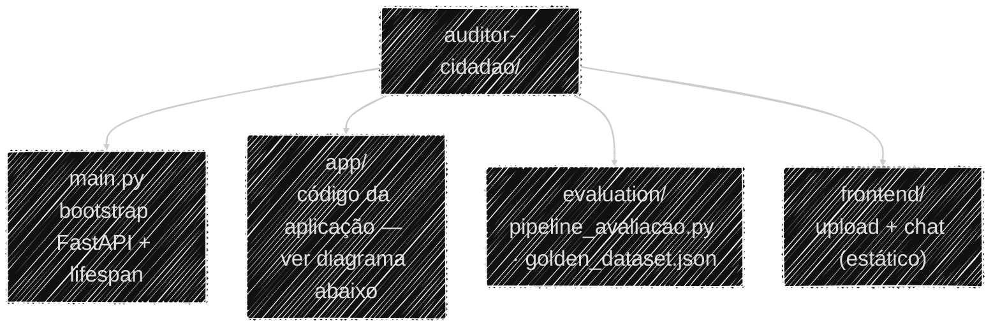
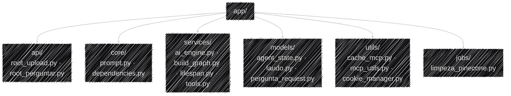

# Codemap

Um mapa de navegação do repositório, não mais um pilar de explicação como os quatro anteriores —
os pilares dizem *por que* o sistema é como é; esta página só ajuda a achar *onde* cada peça mora.
Clique num nó do diagrama para ir direto à página de documentação que explica aquele módulo.

Dividido em dois diagramas pelo mesmo motivo do [Fluxo de Dados](arquitetura/fluxo_dados.md): um
único diagrama com todas as pastas de uma vez fica largo demais para caber na coluna sem encolher
até virar texto ilegível (os diagramas deste site não usam rolagem horizontal de propósito — ver
`docs/stylesheets/extra.css`). Separado em dois níveis, cada um cabe numa leitura só.

## Estrutura de alto nível

## Dentro de `app/`

Referência em tabela, para quem preferir (ou não conseguir clicar no diagrama, ex.: leitor de tela):

| Pasta/arquivo | O que tem lá | Documentação relacionada |
|---|---|---|
| `main.py` | Monta o `FastAPI(...)`, registra os routers e os exception handlers globais | [Setup local](operacional/setup_local.md) |
| `app/api/` | Os dois endpoints HTTP (`/upload/`, `/conversar-com-auditor/`) — só a "borda", validação e tradução de erro em status HTTP | [Referência de API](operacional/api.md) |
| `app/core/` | `prompt.py` (os 4 prompts do sistema) e `dependencies.py` (config + singletons) | [Modelos e Prompts](ia/modelos_prompts.md) |
| `app/services/` | O agente em si: `build_graph.py` (`create_agent`), `ai_engine.py` (`run_agent`, streaming), `lifespan.py` (startup), `tools.py` (as 4 tools nativas) | [Arquitetura do Sistema](arquitetura/visao_geral.md) |
| `app/models/` | Schemas Pydantic — `agent_state.py` (estado do grafo), `laudo.py` (`RelatorioInicial`), `pergunta_request.py` (validação de entrada) | [Relatório Automático e Extração de Laudo](ia/extracao_laudo.md) |
| `app/utils/` | `cache_mcp.py` (cache Redis de tools), `mcp_utils.py` (patch de schema do MCP), `cookie_manager.py` (identificação de cliente) | [Protocolo MCP](arquitetura/protocolo_mcp.md) |
| `app/jobs/` | `limpeza_pinecone.py` — script standalone de retenção, roda como cron | [Uso de Dados e RAG](ia/rag_dados.md#limpeza-de-dados-expirados) |
| `evaluation/` | Framework de avaliação: golden dataset + pipeline + resultados | [Avaliação (RAGAS)](ia/avaliacao.md) |
| `frontend/` | HTML/CSS/JS estático (upload + chat), servido pelo próprio FastAPI | [Docker & Deploy](operacional/docker.md) |

!!! note "Por que fora dos 4 pilares"
    Os pilares (Operacional, Arquitetura, Engenharia de IA, Governança) são organizados por
    **assunto** — cada um explica um aspecto do sistema inteiro. O codemap é organizado por
    **estrutura de pastas** — é a mesma informação vista de outro ângulo, útil quando a pergunta é
    "em que arquivo eu mexo para fazer X" em vez de "por que o sistema faz X assim".
