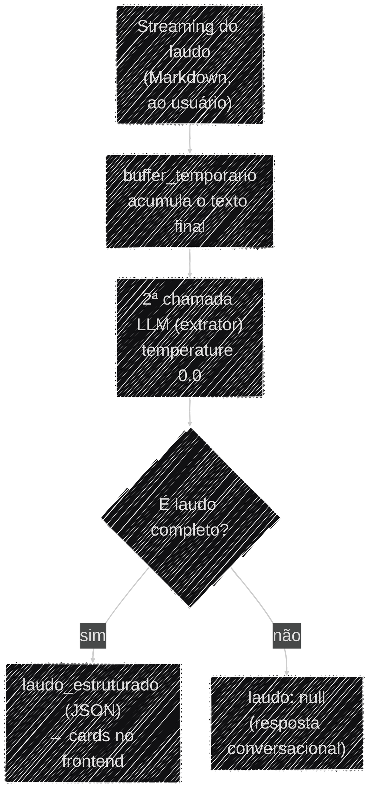

# Extração do Laudo Estruturado

O agente entrega o laudo em duas formas: o **Markdown** que aparece no chat em streaming, e um
**JSON estruturado** que o frontend usa para desenhar os cards de anomalia e de risco. Esta página
explica como o JSON é extraído do Markdown e as decisões de engenharia por trás disso.

## O schema (`RespostaLaudo`)

O formato do JSON é um schema Pydantic em `app/models/laudo.py`:

- **`RespostaLaudo`** — o envelope. Tem um único campo, `laudo`, que é `LaudoEstruturado` **ou
  `None`**. `None` sinaliza que o texto não era um laudo (ex.: resposta conversacional).
- **`LaudoEstruturado`** — `cnpjs_analisados`, `anomalias`, `nivel_risco_geral`, `resumo_executivo`,
  `recomendacoes`.
- **`Anomalia`** — `codigo` (uma letra `A`–`I` do [catálogo](anomalias.md)), `descricao`,
  `evidencias` e `nivel_risco` (`BAIXO`/`MÉDIO`/`ALTO`/`CRÍTICO`).

Os textos em `Field(description=...)` não são só documentação — o próprio LLM extrator os lê para
saber o que preencher em cada campo.

### Exemplo de saída

Ilustrativo, construído a partir do `caso_01` do golden dataset (empresa com sanção vigente em
CEIS/CNEP, ver [Avaliação](avaliacao.md)) — não é um output literal capturado em produção, mas
segue o schema real campo a campo:

```json
{
  "laudo": {
    "cnpjs_analisados": ["38504819000169"],
    "anomalias": [
      {
        "codigo": "H",
        "descricao": "Empresa vencedora do certame consta com sanção vigente no CEIS.",
        "evidencias": [
          "CNPJ 38.504.819/0001-69 possui registro de Suspensão ativo no CEIS.",
          "Registro classificado com Tipo: \"Suspensão\", fonte: Portal da Transparência (CGU)."
        ],
        "nivel_risco": "CRÍTICO"
      }
    ],
    "nivel_risco_geral": "CRÍTICO",
    "resumo_executivo": "A empresa vencedora da dispensa eletrônica consta com sanção vigente no CEIS (Suspensão), o que configura impedimento legal expresso para contratar com a administração pública (Lei 14.133/2021, art. 14).",
    "recomendacoes": [
      "Suspender a contratação até confirmação formal da vigência da sanção junto ao órgão sancionador.",
      "Verificar manualmente se há decisão judicial suspendendo os efeitos da sanção."
    ]
  }
}
```

Para uma resposta conversacional (ex.: "qual o valor do contrato?"), o extrator devolve
`{"laudo": null}` — nenhum outro campo é preenchido.

## Como a extração acontece

Depois que o laudo em Markdown já foi transmitido ao usuário, `run_agent`
(`app/services/ai_engine.py`) faz uma **segunda chamada ao LLM** — o *extrator* — que recebe o
`PROMPT_EXTRATOR` como `SystemMessage` e o texto do laudo como `HumanMessage`, e devolve o
`RespostaLaudo` via `with_structured_output`. O extrator roda a `temperature=0.0` (extração é
tarefa determinística, não criativa) e é uma instância dedicada, criada no `lifespan` e recuperada
via `get_extrator()`.



Se `resultado.laudo` não for `None`, um evento SSE `laudo_estruturado` é emitido. A extração fica
isolada num `try/except` próprio: se falhar, emite um `laudo_estruturado_erro` mas **não** derruba o
evento `done` — o Markdown já foi entregue com sucesso, então a falha na versão estruturada não
compromete a resposta principal.

## Decisões de engenharia (trade-offs)

!!! note "Buffer-then-commit: por que o laudo não é montado direto no streaming"
    Acumular o texto direto no evento `on_chat_model_stream` seria mais simples, mas contaminaria o
    laudo com texto de rodadas intermediárias do agente — o modelo pode emitir conteúdo *antes* de
    os `tool_calls` daquela mensagem aparecerem completos no chunk. A solução acumula em
    `buffer_temporario` e só confirma no `laudo_completo` quando `on_chat_model_end` garante que
    aquela mensagem **não teve** `tool_calls`. É a resposta para "como vocês garantem que o JSON
    reflete só a resposta final, sem ruído de raciocínio intermediário?".

!!! note "Schema define forma, prompt define comportamento"
    `with_structured_output` garante que a saída *valida* contra o schema — mas não decide sozinho
    *quando* usar `laudo: null`. Sem instrução explícita, o modelo tentava preencher um laudo mesmo
    em respostas conversacionais. Foi preciso um `SystemMessage` dedicado (o `PROMPT_EXTRATOR`) com
    o critério de decisão explícito. É um exemplo prático de que o schema Pydantic sozinho não basta
    — o comportamento vem do prompt (T2).

!!! note "Por que não uma heurística de texto ou de tool chamada"
    Duas alternativas mais baratas foram testadas e descartadas: (1) detectar o laudo por um marcador
    no Markdown — quebra assim que o formato do `SYSTEM_PROMPT` muda; (2) decidir pela presença de
    uma tool de auditoria no turno — gera falso positivo (ex.: "verifica esse CNPJ pra mim" chama
    uma tool, mas não é um laudo completo). A decisão final foi delegar ao próprio LLM extrator, via
    o critério explícito do `PROMPT_EXTRATOR`, em vez de uma heurística fixa no código.

!!! note "Por que não `response_format=` do create_agent"
    `create_agent` (ver [Arquitetura](../arquitetura/visao_geral.md)) aceita um parâmetro
    `response_format=` que faz o próprio agente devolver uma saída validada contra um schema Pydantic
    — em tese, dava para passar `RespostaLaudo` ali e eliminar a segunda chamada ao LLM. Avaliado e
    descartado por dois motivos, confirmados inspecionando o grafo compilado (`agent.get_graph()`)
    com `response_format` ativo:

    1. **`response_format` se aplica a toda invocação, não só ao laudo.** O agente responde tanto
       perguntas conversacionais quanto laudos completos no mesmo fluxo — `response_format` forçaria
       toda resposta final (inclusive as conversacionais) a validar contra `RespostaLaudo`, perdendo
       a distinção que hoje vive no `PROMPT_EXTRATOR` (`laudo: null` quando não é laudo).
    2. **Muda o que conta como "resposta final" no streaming.** Com `response_format` ativo, o nó
       `model` ganha uma aresta condicional de auto-loop (`model → model`) para validar/repetir a
       saída estruturada — nesse desenho, a resposta final deixa de ser texto Markdown de streaming
       livre e passa a ser vinculada à validação do schema. Isso quebraria o streaming token-a-token
       do laudo em Markdown que o frontend já renderiza, ou exigiria desenhar dois caminhos de
       resposta dentro do mesmo agente.

    Manter a segunda chamada (extrator dedicado, fora do grafo principal) preserva os dois
    comportamentos — streaming de Markdown livre + JSON estruturado só quando aplicável — ao custo de
    uma chamada extra ao LLM por turno. Decisão consciente, não desconhecimento do recurso.