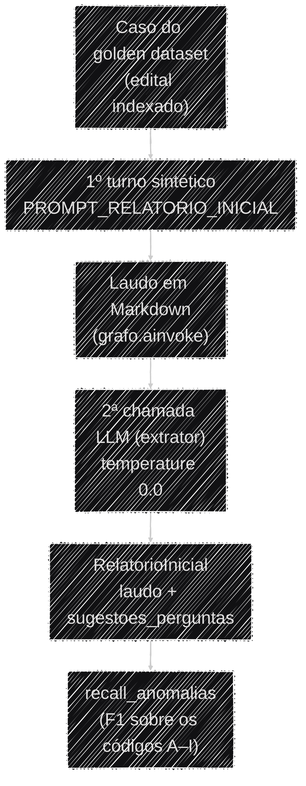

# Relatório automático e extração do laudo

O **relatório automático** é a primeira mensagem que o usuário vê no chat depois de subir um edital —
uma auditoria completa gerada sozinha, sem nenhuma pergunta. Em produção ele é apenas o **primeiro
turno do agente**, entregue por streaming (Markdown, token a token, com o status de cada tool), igual
a qualquer outro turno — ver [Anatomia de um turno](../arquitetura/anatomia_de_um_turno.md#o-relatorio-automatico-turno-1-do-chat-nao-parte-do-upload).

A **extração de um laudo estruturado** (`RelatorioInicial` — JSON com códigos de anomalia,
nível de risco, etc.) **não roda mais em produção**. Ela vive hoje só no framework de avaliação
([`backend/evaluation/`](https://github.com/Moreira-89/auditor-cidadao/tree/main/backend/evaluation)),
que precisa de anomalias em forma de código (`A`–`I`) para a métrica `recall_anomalias` pontuar. Esta
página documenta essa extração — o schema e as decisões de engenharia continuam válidos para o
harness de avaliação.

!!! info "Por que produção não estrutura mais o laudo"
    Antes do Bloco 15, o `/upload/` rodava o turno do relatório **e** uma segunda chamada de LLM para
    extrair o `RelatorioInicial`, tudo síncrono dentro do request. Somado ao Docling, o upload
    passava de 4 minutos e o navegador derrubava a conexão. O relatório virou um turno de chat
    streamado; a extração estruturada, um custo que só a avaliação paga.

## O schema (`RelatorioInicial`)

O formato do JSON é um schema Pydantic em [`app/api/schemas/laudo.py`](https://github.com/Moreira-89/auditor-cidadao/blob/main/backend/app/api/schemas/laudo.py):

- **`RelatorioInicial`** — o envelope. Tem dois campos: `laudo`, que é `LaudoEstruturado` **ou
  `None`** (`None` sinaliza que o texto gerado não era um laudo — ex.: o agente recusou a
  solicitação), e `sugestoes_perguntas`, até 3 perguntas de acompanhamento.
- **`LaudoEstruturado`** — `cnpjs_analisados`, `anomalias`, `nivel_risco_geral`, `resumo_executivo`,
  `recomendacoes`.
- **`Anomalia`** — `codigo` (uma letra `A`–`I` do [catálogo](anomalias.md)), `descricao`,
  `evidencias` e `nivel_risco` (`BAIXO`/`MÉDIO`/`ALTO`/`CRÍTICO`).

Os textos em `Field(description=...)` não são só documentação — o próprio LLM extrator os lê para
saber o que preencher em cada campo.

### Exemplo de saída

Ilustrativo, construído a partir de um caso do golden dataset (empresa com sanção vigente em
CEIS/CNEP, ver [Avaliação](avaliacao.md)) — não é um output literal, mas segue o schema campo a campo:

```json
{
  "laudo": {
    "cnpjs_analisados": ["38504819000169"],
    "anomalias": [
      {
        "codigo": "H",
        "descricao": "Empresa vencedora do certame consta com sanção vigente no CEIS.",
        "evidencias": [
          "CNPJ 38.504.819/0001-69 possui registro de Suspensão ativo no CEIS.",
          "Registro classificado com Tipo: \"Suspensão\", fonte: Portal da Transparência (CGU)."
        ],
        "nivel_risco": "CRÍTICO"
      }
    ],
    "nivel_risco_geral": "CRÍTICO",
    "resumo_executivo": "A empresa vencedora da dispensa eletrônica consta com sanção vigente no CEIS (Suspensão), o que configura impedimento legal expresso para contratar com a administração pública (Lei 14.133/2021, art. 14).",
    "recomendacoes": [
      "Suspender a contratação até confirmação formal da vigência da sanção junto ao órgão sancionador.",
      "Verificar manualmente se há decisão judicial suspendendo os efeitos da sanção."
    ]
  },
  "sugestoes_perguntas": [
    "A sanção vigente da empresa 38.504.819/0001-69 já foi confirmada junto ao órgão sancionador?",
    "Existe decisão judicial suspendendo os efeitos dessa sanção?",
    "Quais outras empresas participaram dessa licitação além da vencedora?"
  ]
}
```

Se o agente não produzir um laudo (recusa por fora de escopo, mensagem de erro), o extrator devolve
`laudo: null` mas ainda preenche `sugestoes_perguntas` com perguntas genéricas.

## Como a extração acontece (no harness de avaliação)

`gerar_relatorio_inicial()` ([`app/agents/relatorio.py`](https://github.com/Moreira-89/auditor-cidadao/blob/main/backend/app/agents/relatorio.py)) é chamada por
[`evaluation/execucao.py`](https://github.com/Moreira-89/auditor-cidadao/blob/main/backend/evaluation/execucao.py)
para cada caso do golden dataset. Ela dispara o **primeiro turno da thread** com
`PROMPT_RELATORIO_INICIAL` como se fosse a pergunta do usuário (via `grafo.ainvoke()`, sem streaming —
o harness precisa do texto completo de uma vez), e então faz uma **segunda chamada ao LLM** — o
*extrator* — que recebe o `PROMPT_EXTRATOR_INICIAL` como `SystemMessage` e o texto do laudo como
`HumanMessage`, devolvendo o `RelatorioInicial` via `with_structured_output`. O extrator roda a
`temperature=0.0` e é uma instância dedicada recuperada via `get_extrator()`.

O turno do agente aqui é equivalente ao de produção: mesmo grafo, mesmo `PROMPT_RELATORIO_INICIAL`,
mesmo envelope (`PROMPT_DINAMICO`), mesmas tools. A diferença é só de entrega — `grafo.ainvoke()` no
harness, `astream_events()` em produção — e o passo extra de extração estruturada, exclusivo do
harness.



A função inteira está isolada num `try/except`: qualquer falha vira `None`.

## Decisões de engenharia (trade-offs)

!!! note "Por que uma segunda chamada ao LLM, em vez de extrair no meio do streaming"
    O harness usa `grafo.ainvoke()`, não `astream_events()` — o texto completo do laudo já está
    disponível de uma vez antes de chamar o extrator. Isso evita o problema que existiria se a
    extração tentasse acumular texto turno a turno: o modelo pode emitir conteúdo parcial *antes* de
    decidir chamar uma ferramenta, e só a mensagem final (sem `tool_calls`) deve virar laudo.

!!! note "Schema define forma, prompt define comportamento"
    `with_structured_output` garante que a saída *valida* contra o schema — mas não decide sozinho
    *quando* usar `laudo: null` nem como formular `sugestoes_perguntas`. Foi preciso um
    `SystemMessage` dedicado (o `PROMPT_EXTRATOR_INICIAL`) com o critério de decisão explícito. O
    schema Pydantic sozinho não basta — o comportamento vem do prompt (T2).

!!! note "Por que não `response_format=` do create_agent"
    `create_agent` aceita um `response_format=` que faz o próprio agente devolver saída validada
    contra um schema — em tese eliminaria a segunda chamada. Descartado por dois motivos,
    confirmados inspecionando o grafo compilado:

    1. **`response_format` se aplica a toda invocação.** O mesmo grafo (`get_graph()`) responde
       perguntas conversacionais comuns via `run_agent()` — forçaria toda resposta final a validar
       contra o schema do laudo, mesmo as puramente conversacionais.
    2. **Muda o que conta como "resposta final".** Com `response_format` ativo, o nó `model` ganha uma
       aresta de auto-loop (`model → model`) para validar a saída estruturada — isso quebraria o
       streaming token-a-token que `run_agent()` usa (inclusive no relatório automático de produção).

    Manter a segunda chamada (extrator dedicado, fora do grafo principal) preserva o streaming de
    Markdown em produção e ainda dá ao harness o JSON estruturado que ele precisa.
