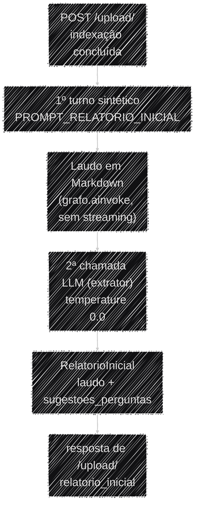

# Relatório Automático e Extração do Laudo

Assim que o upload de um edital termina de indexar, o sistema gera sozinho — sem esperar nenhuma
pergunta do usuário — um primeiro laudo completo sobre aquele edital, o **relatório automático**.
Esse laudo é entregue em duas formas: o **Markdown** que aparece como a primeira mensagem do chat, e
um **JSON estruturado** que o frontend usa para desenhar os cards de anomalia e de risco. Esta
página explica como o JSON é extraído do Markdown e as decisões de engenharia por trás disso.

!!! info "Só existe um laudo estruturado por thread"
    O relatório automático é a única vez, numa conversa, em que o agente produz um laudo completo
    estruturado. Perguntas seguintes do usuário — mesmo pedindo explicitamente outra auditoria —
    recebem resposta em Markdown livre via `run_agent()` (`app/services/ai_engine.py`), sem passar
    por extração estruturada nem gerar um novo card. A decisão é de produto, não uma limitação
    técnica: o usuário raramente sabe que pode pedir outro laudo, e refazê-lo custaria uma chamada
    extra ao LLM para reconstruir uma análise já entregue no início da conversa.

## O schema (`RelatorioInicial`)

O formato do JSON é um schema Pydantic em `app/models/laudo.py`:

- **`RelatorioInicial`** — o envelope do relatório automático. Tem dois campos: `laudo`, que é
  `LaudoEstruturado` **ou `None`** (`None` sinaliza que o texto gerado não era um laudo — ex.: o
  agente recusou a solicitação), e `sugestoes_perguntas`, até 3 perguntas de acompanhamento
  específicas ao conteúdo lido.
- **`LaudoEstruturado`** — `cnpjs_analisados`, `anomalias`, `nivel_risco_geral`, `resumo_executivo`,
  `recomendacoes`.
- **`Anomalia`** — `codigo` (uma letra `A`–`I` do [catálogo](anomalias.md)), `descricao`,
  `evidencias` e `nivel_risco` (`BAIXO`/`MÉDIO`/`ALTO`/`CRÍTICO`).

Os textos em `Field(description=...)` não são só documentação — o próprio LLM extrator os lê para
saber o que preencher em cada campo.

### Exemplo de saída

Ilustrativo, construído a partir do `caso_01` do golden dataset (empresa com sanção vigente em
CEIS/CNEP, ver [Avaliação](avaliacao.md)) — não é um output literal capturado em produção, mas
segue o schema real campo a campo:

```json
{
  "laudo": {
    "cnpjs_analisados": ["38504819000169"],
    "anomalias": [
      {
        "codigo": "H",
        "descricao": "Empresa vencedora do certame consta com sanção vigente no CEIS.",
        "evidencias": [
          "CNPJ 38.504.819/0001-69 possui registro de Suspensão ativo no CEIS.",
          "Registro classificado com Tipo: \"Suspensão\", fonte: Portal da Transparência (CGU)."
        ],
        "nivel_risco": "CRÍTICO"
      }
    ],
    "nivel_risco_geral": "CRÍTICO",
    "resumo_executivo": "A empresa vencedora da dispensa eletrônica consta com sanção vigente no CEIS (Suspensão), o que configura impedimento legal expresso para contratar com a administração pública (Lei 14.133/2021, art. 14).",
    "recomendacoes": [
      "Suspender a contratação até confirmação formal da vigência da sanção junto ao órgão sancionador.",
      "Verificar manualmente se há decisão judicial suspendendo os efeitos da sanção."
    ]
  },
  "sugestoes_perguntas": [
    "A sanção vigente da empresa 38.504.819/0001-69 já foi confirmada junto ao órgão sancionador?",
    "Existe decisão judicial suspendendo os efeitos dessa sanção?",
    "Quais outras empresas participaram dessa licitação além da vencedora?"
  ]
}
```

Se o agente não produzir um laudo (ex.: recusa por fora de escopo, mensagem de erro), o extrator
devolve `laudo: null`, mas ainda preenche `sugestoes_perguntas` com perguntas genéricas úteis para
começar a explorar o edital.

## Como a extração acontece

`gerar_relatorio_inicial()` (`app/services/ai_engine.py`) roda logo após `POST /upload/` terminar de
indexar o edital no Pinecone (ver [Fluxo de Dados](../arquitetura/fluxo_dados.md)). Ela dispara o
**primeiro turno da thread** com `PROMPT_RELATORIO_INICIAL` como se fosse a pergunta do usuário
(via `grafo.ainvoke()`, sem streaming — a resposta faz parte do corpo síncrono de `/upload/`, não do
canal SSE de conversa), e então faz uma **segunda chamada ao LLM** — o *extrator* — que recebe o
`PROMPT_EXTRATOR_INICIAL` como `SystemMessage` e o texto do laudo como `HumanMessage`, devolvendo o
`RelatorioInicial` via `with_structured_output`. O extrator roda a `temperature=0.0` (extração é
tarefa determinística, não criativa) e é uma instância dedicada, criada no `lifespan` e recuperada
via `get_extrator()`.



A função inteira está isolada num `try/except`: qualquer falha (LLM, extração, timeout) é logada e
vira `None` — o upload não pode falhar por causa do relatório automático, que é um "bônus" de UX,
não um requisito do fluxo de indexação. Nesse caso o frontend simplesmente não mostra a primeira
mensagem automática, e o usuário parte do estado vazio normal.

## Decisões de engenharia (trade-offs)

!!! note "Por que uma segunda chamada ao LLM, em vez de extrair no meio do streaming"
    O relatório automático não usa streaming (`grafo.ainvoke()`, não `astream_events()`) — ele faz
    parte da resposta síncrona de `/upload/`, então o texto completo do laudo já está disponível de
    uma vez antes de chamar o extrator. Isso evita o problema que existiria se a extração tentasse
    acumular texto turno a turno em paralelo ao streaming: o modelo pode emitir conteúdo parcial
    *antes* de decidir chamar uma ferramenta, e só a mensagem final (sem `tool_calls`) deve virar
    laudo.

!!! note "Schema define forma, prompt define comportamento"
    `with_structured_output` garante que a saída *valida* contra o schema — mas não decide sozinho
    *quando* usar `laudo: null` nem como formular `sugestoes_perguntas`. Foi preciso um
    `SystemMessage` dedicado (o `PROMPT_EXTRATOR_INICIAL`) com o critério de decisão explícito e a
    instrução de que as sugestões precisam ser específicas ao conteúdo lido, nunca genéricas. É um
    exemplo prático de que o schema Pydantic sozinho não basta — o comportamento vem do prompt (T2).

!!! note "Por que não uma heurística de texto ou de tool chamada"
    Duas alternativas mais baratas foram testadas e descartadas: (1) detectar o laudo por um marcador
    no Markdown — quebra assim que o formato do `SYSTEM_PROMPT` muda; (2) decidir pela presença de
    uma tool de auditoria no turno — gera falso positivo. A decisão final foi delegar ao próprio LLM
    extrator, via o critério explícito do `PROMPT_EXTRATOR_INICIAL`, em vez de uma heurística fixa
    no código.

!!! note "Por que não `response_format=` do create_agent"
    `create_agent` (ver [Arquitetura](../arquitetura/visao_geral.md)) aceita um parâmetro
    `response_format=` que faz o próprio agente devolver uma saída validada contra um schema Pydantic
    — em tese, dava para passar `RelatorioInicial` ali e eliminar a segunda chamada ao LLM. Avaliado
    e descartado por dois motivos, confirmados inspecionando o grafo compilado (`agent.get_graph()`)
    com `response_format` ativo:

    1. **`response_format` se aplica a toda invocação, não só ao relatório automático.** O mesmo
       agente (`get_graph()`) também responde perguntas conversacionais comuns via `run_agent()` —
       `response_format` forçaria toda resposta final a validar contra o schema do laudo, mesmo as
       puramente conversacionais.
    2. **Muda o que conta como "resposta final".** Com `response_format` ativo, o nó `model` ganha
       uma aresta condicional de auto-loop (`model → model`) para validar/repetir a saída
       estruturada — isso quebraria o streaming token-a-token que `run_agent()` usa nas perguntas
       comuns, ou exigiria desenhar dois caminhos de resposta dentro do mesmo agente.

    Manter a segunda chamada (extrator dedicado, fora do grafo principal, usado só em
    `gerar_relatorio_inicial()`) preserva os dois comportamentos — streaming de Markdown livre nas
    perguntas comuns + JSON estruturado só no relatório automático — ao custo de uma chamada extra ao
    LLM, paga uma única vez por thread.

!!! note "Por que essa extração não roda mais a cada turno de conversa"
    Numa versão anterior, `run_agent()` chamava um extrator equivalente (`RespostaLaudo`/
    `PROMPT_EXTRATOR`) depois de **toda** resposta do agente, para decidir se valia a pena montar um
    card estruturado. Na prática isso significava até dois laudos completos estruturados na mesma
    thread — o automático do upload, e outro caso o usuário pedisse "faça uma análise" de novo — sem
    o usuário sequer saber que a segunda opção existia. Foi removido de `run_agent()`: o card
    estruturado agora é exclusivo do relatório automático, e perguntas seguintes recebem só a
    resposta em Markdown do streaming, sem chamada extra ao LLM por turno. `RespostaLaudo`/
    `PROMPT_EXTRATOR` continuam no código, mas só como réplica usada pelo pipeline de avaliação (ver
    [Avaliação](avaliacao.md)) — não são mais chamados em nenhum caminho de produção.
