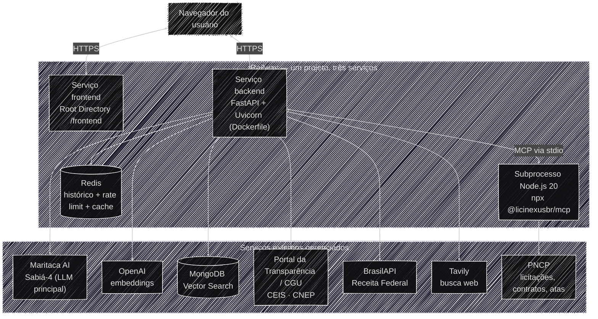

# Operacional & Reprodução

Este pilar cobre a reprodução exata do ambiente do **Auditor Cidadão**: como clonar, configurar e
rodar o projeto — localmente ou via Docker — em qualquer máquina, sem depender de conhecimento
prévio sobre o código.

## Onde e como isso roda em produção

O diagrama abaixo mostra a topologia de hospedagem — quem fala com quem e onde cada peça está
implantada. Ele é sobre **infraestrutura**, não sobre o raciocínio do agente.

Pontos que valem destaque:

- **Monorepo, dois serviços.** `backend/` e `frontend/` são publicados separadamente, distinguidos
  pelo **Root Directory** de cada serviço no Railway, ambos acompanhando a mesma branch — a
  separação é por diretório, não por branch, o que mantém um histórico único no Git. Ver
  [Docker & Deploy](docker.md#deploy-em-producao-railway).
- **Dois processos dentro do serviço de backend** — o FastAPI e o subprocesso Node.js do MCP, que o
  `lifespan` sobe no startup para carregar as 11 ferramentas do PNCP.
- **LLM principal: Maritaca AI (Sabiá-4).** Não vem embutido no container: é uma API externa,
  configurada via `LLM_MODEL` (prefixo `maritaca:`, ver [Variáveis de ambiente](variaveis_ambiente.md)).
  A OpenAI continua no path, mas só para os embeddings do RAG.
- **Redis é o único estado próprio da aplicação**, mas roda como um serviço à parte dentro do mesmo
  projeto Railway (add-on **Database → Redis**, não embutido no container do backend). Guarda três
  coisas independentes — o histórico de conversa por `thread_id`, a contagem do rate limiter e o
  cache de ferramentas (TTL 24h). É esse estado externalizado que viabiliza as 2 réplicas em
  produção, já que o Railway não oferece sticky sessions (ver
  [Docker & Deploy](docker.md#escalonamento-replicas-e-limites-de-recurso)).
- **MongoDB Vector Search guarda os editais indexados**, consultados sob demanda pela tool de RAG —
  o conteúdo do edital nunca é pré-carregado no contexto do agente. Banco e coleção ficam
  configurados via variáveis de ambiente, não fixados na documentação (ver
  [Variáveis de ambiente](variaveis_ambiente.md)).
- **Variáveis de ambiente** são cadastradas diretamente no painel do Railway (mesmas chaves de
  [Variáveis de ambiente](variaveis_ambiente.md)), nunca commitadas.

## Acesse essas páginas para saber mais

- **[Setup local](setup_local.md)** — clonar o repositório, criar o ambiente virtual, instalar
  dependências e subir a aplicação com `uvicorn`.
- **[Referência de API](api.md)** — exemplos reais de request/response dos dois endpoints
  (`curl` para upload e para o streaming SSE de conversa).
- **[Docker & Deploy](docker.md)** — build e execução via container, e como o mesmo Dockerfile é
  usado em produção (Railway).
- **[Variáveis de ambiente](variaveis_ambiente.md)** — referência completa de cada chave exigida
  ou opcional, o que ela controla e onde obtê-la.
