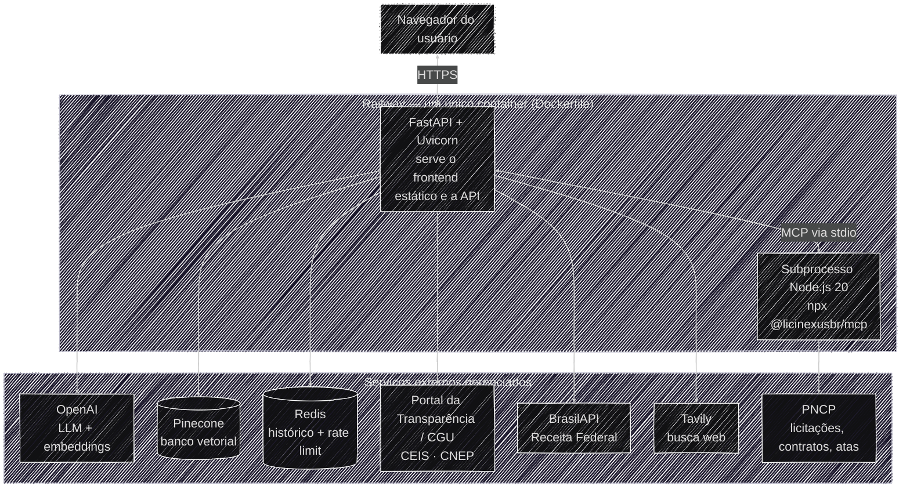

# Operacional & Reprodução

Este pilar cobre a reprodução exata do ambiente do **Auditor Cidadão**: como clonar, configurar e
rodar o projeto — localmente ou via Docker — em qualquer máquina, sem depender de conhecimento
prévio sobre o código.

## Onde e como isso roda em produção

O diagrama abaixo mostra a topologia de hospedagem — quem fala com quem e onde cada peça está
implantada. Ele é sobre **infraestrutura**, não sobre o raciocínio do agente.

Pontos que vale destacar:

- **Um único container, dois processos** — o mesmo `Dockerfile` que você usa localmente (ver
  [Docker & Deploy](docker.md)) é o que roda em produção. Não há um serviço de frontend separado:
  o FastAPI serve os arquivos estáticos (`frontend/`) e a API na mesma porta. É uma decisão
  consciente de simplicidade para o estágio atual do projeto — já está em backlog migrar o frontend
  para uma stack dedicada (React), o que separaria esse diagrama em dois serviços
  (frontend e backend) e traria uma experiência mais rica para o usuário final.
- **Redis é o único estado próprio da aplicação** (não vem embutido no container — é um serviço
  externo, um add-on gerenciado no Railway). Guarda duas coisas independentes: o histórico de
  conversa por `thread_id` (`AsyncRedisSaver`, ver [Visão Geral](../arquitetura/visao_geral.md)) e a
  contagem de requisições do rate limiter (ver [Limitações conhecidas](../governanca/limitacoes.md)).
  Isso substituiu o antigo `InMemorySaver` (RAM do processo) — a troca resolveu de uma vez a perda
  de histórico a cada restart **e** o pré-requisito de estado compartilhado entre múltiplas
  réplicas, viabilizando o escalonamento horizontal hoje em produção (2 réplicas, 1 worker cada —
  ver [Docker & Deploy](docker.md#escalonamento-replicas-e-limites-de-recurso)).
- **Variáveis de ambiente** são cadastradas diretamente no painel do Railway (mesmas chaves de
  [Variáveis de ambiente](variaveis_ambiente.md)), nunca commitadas.

## Acesse essas páginas para saber mais

- **[Setup local](setup_local.md)** — clonar o repositório, criar o ambiente virtual, instalar
  dependências e subir a aplicação com `uvicorn`.
- **[Docker & Deploy](docker.md)** — build e execução via container, e como o mesmo Dockerfile é
  usado em produção (Railway).
- **[Variáveis de ambiente](variaveis_ambiente.md)** — referência completa de cada chave exigida
  ou opcional, o que ela controla e onde obtê-la.
